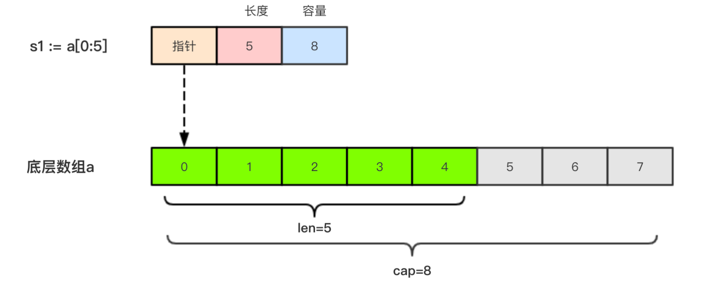
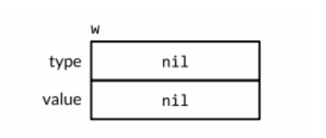

# Go 语言基础

## 一、变量声明

```go
import main
//单独声明：var 变量名 类型
var name string
var age int
var gender bool
//批量声明：
var(
	name string
  age int
  gender bool
)	
func main() {
  //初始化
  name = "liujie"
  age = 21
  gender = true
  //变量声明同时初始化
  var s1 string = "123"
  //简短声明
  s2 := "123"
  //匿名变量：_,用一个下划线表示，如一个函数有两个返回值，但是只需要一个，则另一个可以用_接受
 
  //常量声明，常量必须初始化
  const PI = 3.1415926
  //若声明多个常量后面的不出话则和上面的相等
  const(
  	t1 = 100
    t2				//t2 = t1 = 100
    t3				//同上
  )
  //iota是go中的常量计数器，每有一行则iota+1，第一次碰到const为0
  const(
		a1 = iota		//0
		a2					//1
		a3					//2
	)
  //举例
  const (
		_  = iota
		KB = 1 << (iota * 10)
		MB = 1 << (iota * 10)
		GB = 1 << (iota * 10)
		TB = 1 << (iota * 10)
		PB = 1 << (iota * 10)
	)
}
```

## 二、基本数据类型

**整形：**

- 按长度分：int8、int16、int32、int64
- 无符号：uint8、uint16、uint32、uint64
- 特殊：int，在32位操作系统就是int32，在64位操作系统就是int64
- 可以直接赋值为其他进制，如 var i int = 0xff

**浮点数**：float32、float64

**复数**：complex64、complex128，var c complex = 1 + 2i

**波尔值**：bool

- 默认值为 false
- bool 值不能作为数值运算，也无法进行转换
- Go 不允许将 int 强转为 bool

**字符串**：string,多行字符串用反引号包括(`   `)

**字符类型**：

- int8（byte）：代表一个 ASCII码的字符
- rune：rune 实际上是一个 int32，代表 utf-8字符

```go
//字符串改变
	s := "liujie"
	byte1 := []byte(s)
	byte1[0] = 'b'
	s = string(byte1)
	fmt.Println(s)
```

强制类型转换：

```go
var t int 
t = int('b')
```

## 三、条件判断

```go
//if else
var t int = 2
if t == 1 {
  fmt.Println(1)
}else t == 2 {
  fmt.Println(2)
}else
fmt.Println(3)
//switch case
	i := 3
	switch i {
	case 1:
		fmt.Println(i)
	case 2:
		fmt.Println(i)
	case 3:
		fmt.Println(i)
		fallthrough
	case 4:
		fmt.Println(4)
	}
```

**注意**：

- 每个左括号必须和 if、else、else if 在同一行
- 一个 switch 语句中只能有一个 deafult
- 加上 fallthrough 后会接着执行下一个 case
- case 支持多个值，用逗号隔开，还支持 范围条件

## 四、循环结构

```go
for i := 0; i < 10; i++ {
  fmt.Println(i)
}
//for range 循环
var arr = [...]int{1,2,3,4,5}
for k,v := range arr {
	fmt.Println(k,":",v)
}
```

- goto 的使用

    作用：直接跳转到指定标签出,break 和 continue 就不解释了

```go
for i := 0; i < 10; i++ {
		for j := 0; j < 10; j++ {
			if j == 2 {
				// 设置退出标签
				goto breakTag
			}
			fmt.Printf("%v-%v\n", i, j)
		}
	}
	return
	// 标签
breakTag:
	fmt.Println("结束for循环")
```

## 五、数组、切片、map

### 数组

**定义：**var arr [3]int，不同长度的数组为不同类型不能直接赋值,默认值为0

**初始化：**

- var arr = [3]int{1,2,3}
- var arr = [...]int{1,2}，不表明长度
- var arr = [...]int(1:1,3:5)，指定索引处的值，[0,1,0,5]

### 切片

**定义：**var name []int，切片是一个拥有相同类型的可变长度的序列，基于数组类型做的一层封装，比较灵活支持自动扩容

**长度：**元素个数

**容量：**从第一个元素数，到底层数组的最后元素的个数

**基于数组创建切片：**

```go
sl := arr[1:3]
fmt.Println("sl:",sl,"len(sl)",len(sl),"cap(sl)",cap(sl))
sl1 := sl[3:4]	fmt.Println("sl1:",sl1,"len(sl1)",len(sl1),"cap(sl1)",cap(sl1)
                            
//输出
s:[2 3] len(s):2 cap(s):4
s2:[5] len(s2):1 cap(s2):1
```

使用 make() 函数构造切片：make([]int,size,cap)

**本质：**切片的本质就是对数组的封装



**注意：**切片不能直接比较

**添加元素：**s = append(s,2,3,4)

**扩容机制：**一般发生于 append 时，在容量小于 1024时，每次扩容一倍，大于 1024 时，增加原来的四分之一

**切片是引用类型**：直接赋值则为两个变量指向同一块空间，可以使用 copy() 函数进行拷贝，copy(target, src)

**删除元素**：切片本身没有删除的方法，可以使用 s = append(s[:3], s[3:])

**扩容**：

- 扩容时机：当cap<1024时每次✖️2，当cap>1024时每次✖️1.25
- 没发生扩容时，作为函数参数传过去修改的是原内存的值。发生扩容后，修改会在新内存中

```go
// 使用切片实现一个栈
func pop(slice []int64) []int64{
  return slice[:len(slice) - 1]
}

func push(slice []int64, i int64) []int64{
  return append(slice, i)
}

// 删除切片中第 i 个元素
func remove(slice []int64, i int64) {
  copy(slice[i:], slice[i+1:])
  return slice[:len(slice)-1]
}
```


### map

**定义：**map[KeyType]ValueType，map 是引用类型，因此需要初始化才能使用

**初始化：**

- 使用 make() 函数进行初始化，make(map[string]int, cap)

- 也可以直接初始化

  ```go
  userInfo := map[string]int{
    "username":"liujie"
    "age":"21"
  }
  ```

**判断 key 是否存在：**value, ok := userInfo["age"]，ok 是 bool 值，若为 true 则存在，并且 value 被赋值，反之 value 为默认值

**注意：**遍历 map 时的顺序和加入时的顺序无关

**删除：**使用 delete(map, key) 函数来删除

**源码实现在 src/runtime/map.go 中**

## 六、函数

**定义：**func 函数名(参数列表)(返回值列表) {函数体}

**参数：**

- 若前面参数和后面参数的类型相同，前面的参数类型可以省略
- 可以使用 ... 来表示数量不固定的参数，一般放在最后，intSum(x ...int)，x为一个切片

**返回值：**可以只标注返回值类型，最后 return x,y  也可以直接在返回值上标明变量最后直接 return

**定义函数类型：**用 type 定义函数类型，type calculation func(int, int) int，此语句定义了一个函数类型，凡是满足参数和返回值的条件的函数都是 calculation 类型的函数

```go
type calculation func(int, int) int
//下面两个函数都符合
func add(x, y int) int {
	return x + y
}

func sub(x, y int) int {
	return x - y
}
//符合的函数可以直接赋值
var c calculation
c = add
```

**注意：**

- 函数可以当作参数

  ```go
  func add(x, y int) int {
  	return x + y
  }
  func calc(x, y int, op func(int, int) int) int {
  	return op(x, y)
  }
  func main() {
  	ret2 := calc(10, 20, add)
  	fmt.Println(ret2) //30
  }
  ```

- 函数可以当作返回值

  ```go
  func do(s string) (func(int, int) int, error) {
  	switch s {
  	case "+":
  		return add, nil
  	case "-":
  		return sub, nil
  	default:
  		err := errors.New("无法识别的操作符")
  		return nil, err
  	}
  }
  ```

**匿名函数：**

- 因为是匿名的所以需要用变量保存

  ```go
  add := func (x, y int){
    fmt.Println(x + y)
  }
  add(10, 20)
  //输出 30
  ```

- 还可以立即执行一次

  ```go
  func (x, y int) {
    fmt.Println(x + y)
  }(10, 20)
  //直接执行。输出 30
  ```

**defer语句：**defer 语句会将后面跟随的语句进行延迟处理，多个被defer的语句逆序处理，例如：

```go
fmt.Println("start")
defer fmt.Println("1")
defer fmt.Println("2")
defer fmt.Println("3")
fmt.Println("end")
//输出
start
end
3
2
1
```

**闭包：**闭包=函数 + 引用环境，其实就是一个函数的返回值为函数，而返回的函数在不同的环境中都是新的，同一个函数，不同的环境

```go
func squares() func() int {
  var x int
  return func() int {
    x++
    return x * x
  }
} 
func main() {
  f1 := squares()
  f2 := squares()
  
  fmt.Println("first call f1:", f1())
  fmt.Println("second call f1:", f1())
  fmt.Println("first call f2:", f2())
  fmt.Println("second call f2:", f2())                                                  
}
//输出	f1 和 f2 处于不同的环境
1
4
1
4
```

## 七、指针

定义：任何程序载入内存后都有他们的地址值，这就是指针，而需要保存一个数据在内存中的地址，就需要一个指针变量。用 &+变量名获得变量的地址，而*+指针变量表示这个指针变量指向地址的数据

## 八、结构体

定义：go 语言中没有类的概念，以及继承的面向对象特点，通过结构体来实现面向对象

自定义类型： type MyInt int，通过 type 关键字定义 MyInt 就是一种新类型

别名：type Alias = int，byte 就是用的别名，type byte = uint8

自定义类型和别名的区别：

```go
//类型定义
type NewInt int

//类型别名
type MyInt = int

func main() {
	var a NewInt
	var b MyInt
	
	fmt.Printf("type of a:%T\n", a) //type of a:main.NewInt
	fmt.Printf("type of b:%T\n", b) //type of b:int
}
即别名的本质还是原类型
```

结构体定义：

```go
type person struct{
  name string
  age int
  gender bool
}
```

创建结构体指针：

```go
var p2 = new(person)
var p3 = &person{}    //&相当于进行了一次new的实例化操作
//go语言支持结构体指针直接用 . 访问成员。 p2.name = "111"  底层其实是 (*p2).name，是go语言中的一个语法糖
```

结构体的初始化：

```go
p4 := person{
  name : "liujie",
  age : 21,
  gender : 1,
}
//也可以对指针直接初始化(当然也可以只初始化一部分，其他部分为类型的零值)
p5 = &person{
  name : "liujie",
  age : 21,
  gender : 1,
}
//只使用值进行初始化
p6 = person{
  "liujie",
  21,
  1,
}
注意：
		1.该方式下必须初始化结构体的全部字段
		2.填充顺序必须和定义顺序相同
		3.不可和键值的方式混合使用
```

方法与接受者：

- go语言中方法是一种作用于特定类型变量的函数，这个特定类型为**接受者**，定义如下：

  ```go
  func (接收者变量 接收者类型) 方法名(参数列表) (返回参数) {
      函数体
  }
  //例如
  //Person 结构体
  type Person struct {
  	name string
  	age  int8
  }
  
  //NewPerson 构造函数
  func NewPerson(name string, age int8) *Person {
  	return &Person{
  		name: name,
  		age:  age,
  	}
  }
  
  //Dream Person做梦的方法
  func (p Person) Dream() {
  	fmt.Printf("%s的梦想是学好Go语言！\n", p.name)
  }
  
  func main() {
  	p1 := NewPerson("小王子", 25)
  	p1.Dream()
  }
  ```

## 九、包

定义：包可以简单理解为一个存放 .go 文件的文件夹，go 文件都需要在第一行表明归属

```go
package 包名
```

注意：

- 一个文件夹下的文件只能归属一个 package 
- 包名不能和文件夹名相同
- 包名为 main 的包为程序的入口包

可见性：如果想在一个包中去引用另一个包中的信息(变量、常量、函数等)时，改信息必须是对外可见的(public)。go语言中只需要名字的首字母大写即可对外可见，例如

```go
var a string		//小写对外部包不可见
const Mode = 1  //对外部包可见
func Add(x, y int)int {		//对外部包可见
  return x + y
}
func sum(x, y int)int {		//对外部包不可见
  return x + y
}
```

包的别名：

```go
import "fmt"
import m "code.byted.org/gopkg/thrift"		//使用时用 m 就可以调用
```

init() 初始化函数：

- 定义：在 go 语言中执行导入包语句时会自动触发包内的 init() 函数，此函数没有参数也没有返回值，不能主动调用

- 执行时机：

  

- 多层包的执行顺序：

  

## 十一、并发

说明：go 在语言层面就已经内置了调度和上下文切换的机制，goroutine 类似于线程，go 程序会智能的去分配。在 go 语言编程中不需要自己写线程、进程、协程，只需要关注 goroutine，当某个任务需要并发执行的时候，**只需要开启一个 goroutine 去执行这个函数即可，使用更加简单，只需要在函数前加一个 go 关键字即可**

### goroutine 与线程

> 可增长的栈

OS 线程一般都有固定的占内存(一般为 2MB)，一个 goroutine 的栈在其生命周期开始时只有很小的栈(典型情况下 2KB)，goroutine 的栈不是固定的，他可以按需增大和缩小，goroutine 的栈大小限制可以达到 1GB，所以在 Go 语言中一次创建十万左右的 goroutine 也是可以的

>  goroutine 调度：

**GPM** 是 go 语言运行时层面的实现，是 go 语言自己实现的一套调度系统。区别于操作系统调度OS线程。

​	1. G（goroutine） 很好理解，就是 goroutine

​	2. P（processor） 管理着一组 goroutine 队列，P 里面会存储当前 goroutine 运行的上下文环境，P 会对自己管理的 goroutine 队列做一些调度，当自己的队列消费完了就去全局队列里取，如果全局队列也消费完了会去其他队列里抢任务。**P 的个数是通过 `runtime.GOMAXPROCS` 设定，Go 1.5 后默认为可使用的核数**

 	3. M（machine）是 Go 运行时对操作系统内核线程的虚拟，M 与内核线程一般是一一映射的关系，一个 goroutine 最终是要放到 M 上运行

**原文：[GMP模型](https://www.cnblogs.com/sunsky303/p/9705727.html)**

**优势：但从线程调度讲，Go 语言相比起其他语言的优势在于 OS 线程是由 OS 内核来调度的，goroutine 则是由 Go 运行时自己的调度器调度的，这个调度器使用一个成为 m:n 的调度技术（复用/调度 m 个 goroutine 到 n 个OS线程）。其一大特点是 goroutine 的调度是在用户态下完成的，不涉及内核台与用户态之间的频繁切换，包括内存的分配与释放，都是在用户态维护着一块大的内存池，不直接调用系统的 malloc 函数，成本比调度 OS 线程低很多。另一方面充分利用了多核的硬件资源，近似的把若干个 goroutine均分在物理线程上，再加上本身 goroutine 的超轻量，保证了 go 调度方面的性能**

> GOMAXPROCS

Go 运行时的调度器使用 `GOMAXPROCS` 参数来确定使用多少个 OS 线程来同时执行 Go 代码。1.5 后默认为 CPU 核心数。例如一个 8 核的机器，调度器会将 Go 代码调度到 8 个 OS 线程上。

```go
func a() {
    fmt.Println("aaaaaa")
}

func b() {
    fmt.Println("bbbbbb")
}

func main() {
    runtime.GOMAXPROCS(1)	// 此时 a、b 两个任务是一个执行完再执行另一个
    runtime.GOMAXPROCS(2)	// 此时两个任务并发执行
    go a()
    go b()
    time.Sleep(time.Second)
}
```

Go 语言中的操作系统线程和 goroutine 的关系：

1. 一个操作系统线程对应用户态多个 goroutine
2. go 程序可以同时使用多个操作系统线程
3. goroutine 和 OS 线程是多对多的关系，即 m:n

### channel

单纯地将函数并发执行是没有意义的。函数与函数间需要交换数据才能体现并发执行函数的意义

虽然可以使用共享内存进行数据交换，但是共享内存在不通的 goroutine 中容易发生竞争导致数据错误，为了保证数据交换的正确性，必须使用互斥量对内存进行加锁，这必然会导致性能问题

Go 语言的并发模型是 `CSP(Communicating Sequential Processes)`，提倡**通过通信共享内存**而不是**通过共享内存而实现通信**

如果说 goroutine 是 Go 程序并发的执行体，channel 就是它们之间的连接。channel 是可以让一个 goroutine 发送特定值到另一个 goroutine 的通信机制

> **channel：**通道是一种特殊的类型，通道像一个队列，总是遵循先进先出原则。

声明：var 名字 chan 类型

初始化：make(chan 类型, [缓冲大小])

```go
//初始化
ch := make(chan int)	//无缓冲管道，后面解释
//发送	把10发送给管道
ch <- 10
//接收
<- ch
//关闭
close(ch)
```

注意：

- 对于关闭的管道再发送值就会导致panic
- 对于关闭的管道接收会一直获取值直到管道空了
- 对于关闭的管道且没有值进行接收会得到对应类型的零值
- 关闭已经关闭的管道会导致panic

无缓冲管道：

```go
func main() {
	ch := make(chan int)
	ch <- 10
	fmt.Println("发送成功")
} 
//上述代码会发生死锁，无缓冲管道只有在有人接收时才能发送
//利用goroutine解决
func recv(c chan int) {
  ret := <- c
  fmt.Println("接受=收成功", ret)
}
func main() {
	ch := make(chan int)
	go recv(ch) // 启用goroutine从通道接收值
	ch <- 10
	fmt.Println("发送成功")
}
//发送操作回先阻塞，指导另一个goroutine执行接收才会成功。相反，若接收先执行则阻塞等待发送后再接收，去缓冲通道也被称为同步通道。
```

for range 从通道循环取值：

```go
func main() {
  ch1 := make(chan int)
  ch2 := make(chan int)
  //开启goroutine将0-100发送到ch1中
  go func() {
    for i:= 0; i < 100; i++ {
      ch2 <- i
    }
    close(ch1)
  }()
  //开启一个goroutine从ch1中取值，并平方发送到ch2
  go func() {
    for {
    	i, ok := <- ch1
    	if !ok {
      		break
    	}
      ch2 <- i * i
    }
    close(ch2)
  }()
  //在主goroutine中从ch2中接收值
  for i := range ch2 { 	//通道关闭后会退出for range循环
    fmt.Println(i)
  }
}
```

### worker pool（goroutine 池）

在开发中通常使用可以指定启动的 goroutine 数量 - worker pool 模式，控制 goroutine 的数量，防止 goroutine 泄漏和暴涨

**实现一个简单的 work pool**：

```go
func worker(id int, job <-chan, results chan<-) {
    for j := range job {
        fmt.Println("worker: %d start job: %d", id, j)
        time.Sleep(time.Second)
        fmt.Println("worker: %d end job: %d", id, j)
        results <- j * 2
    }
}

func main() {
    jobs := make(chan int, 100)
    results := make(chan int, 100)
    // 开启5个goroutine
    for i := 1; i <= 5; i++ {
        go worker(i, jobs, results)
    }
    // 10个任务
    for i := 1; i <= 10; i++ {
        jobs <- i
    }
    // 输出结果
    for i := 1; i <= 10; i++ {
        fmt.Println(<-results)
    }
}
```

### select 多路复用

在某些场景下我们需要同时从多个通道接受数据。通道在接受数据时，如果没有数据可以接受则会发生阻塞。下面的方式可以解决：

```go
data1, ok := <-ch1
...
data2, ok := <-ch2
...
```

此方式虽然可以实现从多个通道接受值的需求，但是性能较差。Go 内置了 `select` 关键字，可以同时响应多个通道的操作。

`select` 的使用类似于 switch 语句，有一系列的分支和一个默认分支。每个 case 对应一个通道的通信，`select` 会一直等待，直到某个 case 的通信操作完成，则会执行 case 分支的语句。

```go
select{
    case <-ch1:
    	...
    case <-ch2:
    	...
    case <-ch3:
    	...
    default:
    	默认操作
}
```

使用 select 语句能提高代码的可读性

- 可处理一个或多个 channel 的发送/接收操作
- 如果多个 case 同时满足，select 会随机选择一个
- 对于没有 case 的 select{} 会一直等待，可以用于阻塞 main 函数

### 并发安全和锁机制

- **互斥锁**

    互斥锁是一种常用的控制共享资源访问的方法，它能够保证同时只有一个 goroutine 可以访问共享资源。Go 语言中使用 sync 包的 Mutex 类型来实现互斥锁。

    例如两个 goroutine 实现对共享变量的递增

    ```go
    var x int64
    var lock sync.Mutex
    var wg sync.WaitGroup
    
    func add() {
    	for i := 0; i < 5000; i++ {
    		lock.Lock()
    		x = x + 1
    		lock.Unlock()
    	}
    	wg.Done()
    }
    
    func TestSync(t *testing.T) {
    	wg.Add(2)
    	go add()
    	go add()
    	wg.Wait()
    	fmt.Println(x)
    }
    ```

    - 具体实现为当新来一个资源竞争锁时如果能直接抢到锁则直接获得，抢不到则去排队。若等待时长超过1ms则进入公平模式。
    - **先抢再排的优势在于减少了调度的开销**

- **读写锁**
    **读锁**：当一个 goroutine 获取到读锁时其他 goroutine 如果是获取读锁还可以获取到，获取写锁则会等待。`rwlock.RLock()`

    **写锁**：当一个 goroutine 获取到写锁时其他 goroutine 无论是是获取读锁还是写锁都获取不到。`rwlock.Lock()`

- **sync.WaitGroup：**其内部维护着一个计数器，计数器的值可以增加和减少，启动 n 个并发的任务时，计数器加 n 。每个任务完成时调用Done()方法将计数器减一。

```go
//方法一：计数器+delta
(wg * WaitGroup) Add(delta int)
//方法二：计数器减一
(wg *WaitGroup) Done()
//方法三：阻塞到计数器变为0
(wg *WaitGroup) Wait()
```

- **sync.Once：**sync包中提供了Once，针对只执行一次的场景，其下只有个`Do(f func())` 方法。

```go
//go 的单例模式
package singleton

import "sync"

type singleton struct{}
var instance *singleton
var once sync.Once

func GetInstance() *singleton {
  once.Do(func() {
    instance = &singleton{}
  })
  return instance
}
```

- **sync.Map：**go语言内置的 map 不是并发安全的。sync包中提供了一个并发安全的map，和内置的map一样，make初始化完成后即可使用。同时还内置了 Store、Load、Delete、Range等方法

# GO语言标准库

## 一、标准库--fmt

### **输出**

- Print：Print 系列函数会将内容输出到系统的标准输出，区别在于 Print 直接输出，Printf 支持格式化，Println 会换行

  ```go
  fmt.Print("hello   ")
  fmt.Printf("我今年%d岁", 18)
  fmt.Println("会换行的")
  //输出
  hello   我今年18岁
  会换行的
  ```

- Fprint：Fprint 系列函数会将内容输出到一个`io.Write`接口类型的变量中，通常使用它往文件中写入内容

  ```go
  //箱标准输出写入内容
  fmt.Fprintln(os.Stdout, "向标准输出写入内容")
  fileObj, err := os.OpenFile("./xxx.txt", os.O_CREATE|os.O_WRONLY|os.O_APPEND, 0644)
  if err != nil {
    fmt.Println("打开文件出错,err:", err)
    return
  }
  name := "liujie"
  //向打开的文件句柄写入内容
  fmt.Fprintf(fileObj, "往文件中写入内容：%s", name)
  ```

- Sprint：Sprint 系列函数会把传入的数据生成并返回一个字符串

  ```go
  s1 := fmt.Sprint("liujie")
  name := "liujie"
  age := 18
  s2 := fmt.Sprintf("name:%s,age:%d", name, age)
  s3 := fmt.Sprintln("liujie")
  fmt.Println(s1, s2, s3)
  ```

- Errorf：Errorf 函数生成格式化字符串并返回一个包含该字符串的错误

  ```go
  err := fmt.Errorf("这是一个错误")
  ```

- 通用占位符：

  - %v：值的默认格式表示
  - %+v：类似%v，但输出结构体时会添加字段名
  - %#v：值的 go 语法表示
  - %T：打印值的类型

  ```go
  fmt.Printf("%v\n", 100)
  fmt.Printf("%v\n", false)
  o := struct{ name string }{"小王子"}
  fmt.Printf("%v\n", o)
  fmt.Printf("%#v\n", o)
  fmt.Printf("%T\n", o)
  fmt.Printf("100%%\n")
  //输出结果
  100
  false
  {小王子}
  struct { name string }{name:"小王子"}
  struct { name string }
  100%
  ```

- 占位符：

  - %b：表示为二进制
  - %c：对应的 unicode 码值
  - %d：表示为十进制
  - %e：科学计数法
  - %p：指针的十六进制表示，并且有前导的0x
  - %m.nf：宽度为m，精度为n

### **输入**

- fmt.Scan：从标准输入扫描文本，读取空白符分隔的值保存至参数中，换行也视为空白符

```go
var (
		name		string
  	age			int
  	married	bool
)
fmt.Scan(&name, &age, &married)
fmt.Printf("输入结果为：	name:%s	age:%d	married:%t. \n", name, age, married)
```

- fmt.Scanf：以格式化输入

```go
var (
		name		string
  	age			int
  	married	bool
)
fmt.Scanf("1:%s	2:%d	3:%t", &name, &age, &married)
fmt.Printf("输入结果为：	name:%s	age:%d	married:%t. \n", name, age, married)
//输入,只有按照格式输入才会被存入对应的变量
1:liujie	2:22	3:false
```

- fmt.Scanln：必须遇到换行才停止扫描
- buffo.NewReader：输入的内容包含空格

```go
reader := bufio.NewReader(os.Stdin)	//标准输入生成读对象
fmt.Print("请输入：")
text, _ := reader.ReadString("\n")	//一直读到换行
```

- Fscan 系列：不从输入读取，从 io.Reader 中读取

```go
func Fscan(r io.Reader, a ...interface{}) (n int, err error)
func Fscanln(r io.Reader, a ...interface{}) (n int, err error)
func Fscanf(r io.Reader, format string, a ...interface{}) (n int, err error)
```

- Sscan 系列：从指定字符串中读取

```go
func Sscan(str string, a ...interface{}) (n int, err error)
func Sscanln(str string, a ...interface{}) (n int, err error)
func Sscanf(str string, format string, a ...interface{}) (n int, err error)
```

## 二、标准库--time

### **时间类型**

```go
//获取当前时间
now := time.Now()
//获取年、月、日、小时、分钟、秒
year := time.Year()
month := time.Month()
day := time.Day();
hour := time.Hour()
minute := time.Minute()
second := time.Second()
```

### **时间戳**

```go
now := time.Now()
timestamp1 := now.Unix()	//时间戳
timestamp2 := now.UnixNano	//纳秒时间戳
//time.Unix() 可以将时间戳转化为时间
time := time.Unix(now, 0)
```

**时间间隔：**time.Duration 表示两个时间点的时间间隔，以纳秒为单位

```go
const (
    Nanosecond  Duration = 1
    Microsecond          = 1000 * Nanosecond
    Millisecond          = 1000 * Microsecond
    Second               = 1000 * Millisecond
    Minute               = 60 * Second
    Hour                 = 60 * Minute
)
//例如
time.Duration 表示 1 纳秒
time.Second 表示 1 秒
```

### **时间操作**

- Add

```go
now := time.Now()
//一小时后
later := now.Add(time.Hour)
```

- Equal：判断两个时间是否相同，会考虑时区的影响，会比较地点和时区的信息
- Before After：判断是时间点的前后

### **定时器**

```go
//定义一个一秒的定时器
ticker := time.Tick(time.Second)
for i := range ticker {
    fmt.Println(i)	//每秒都会执行
}
```

### **格式化**

时间类型有一个自带的方法，Format 进行格式化，不过不是以 `Y-m-d H:M:S` 而是以 go 语言诞生的时间 2006年1月2号15点04分（2006 1234）。

```go
now := time.Now()
// 格式化的模板为Go的出生时间2006年1月2号15点04分 Mon Jan
// 24小时制
fmt.Println(now.Format("2006-01-02 15:04:05.000 Mon Jan"))
// 12小时制
fmt.Println(now.Format("2006-01-02 03:04:05.000 PM Mon Jan"))
fmt.Println(now.Format("2006/01/02 15:04"))
fmt.Println(now.Format("15:04 2006/01/02"))
fmt.Println(now.Format("2006/01/02"))
```

## 三、文件操作

- 打开和关闭文件

```go
//只读方式打开当前目录下的文件
file, err := os.Open("./main.go")
if err != nil {
    fmt.Println("open file failed!, err:", err)
    return
}
//关闭文件
file.Close()
```

- 读取文件

```go
file, err := os.Open(./main.go)
if err != nil {
    fmt.Println("open file failed, err:", err)
    return
}
defer file.Close()
//使用Read方法读取文件
var tmp = make([]byte, 128)
n, err := file.Read(tmp)
if err == io.EOF {
    fmt.Println("文件读取完成")
    return
}
if err != nil {
    fmt.Println("read file failed, err:", err)
    return
}
fmt.Printf("读取了%d字节数据\n", n)
fmt.Println(string(tmp[:n]))
```

- 写入操作

```go
//os.OpenFile() 函数能够以指定模式打开文件
func OpenFile (name string, flag int, perm FileMode) (*File, error){}
name:
	os.O_WRONLY		只写
	os.O_CREATE		创建
	os.O_RDONLY		只读

//Write、WriteString
file, err := os.OpenFile("xx.txt", os.O_CREATE|os.O_TRUNC|os.O_WRONLY, 0666)
if err != nil {
	fmt.Println("open file failed, err:", err)
	return
}
defer file.Close()
str := "hello 沙河"
file.Write([]byte(str))       //写入字节切片数据
file.WriteString("hello 小王子") //直接写入字符串数据
```

## 四、标准库--strconv

- **Atoi()：将字符串转换成 int，如果不能转换则会返回错误** 

```go
//签名
func Atoi(s string) (i int, err error)

s1 := "100"
i1, err := strconv.Atoi(s1)
if err != nil {
    fmt.Println("不能转换")
} else {
    fmt.Printf("type:%T, value:%v\n",i1, i1)
}
```

- **Itoa()：将 int 转换为字符串**

```go
//签名
func Itoa(i int) (s string)
```

**为什么是 a 呢？**

源于 C 语言中没有 string 类型，用字符数组 array 表示字符串

**Parse 系列函数**

- **ParseBool()**

```go
//签名
func ParseBool(str string) (value bool, err error)
返回字符串所表示的 bool 值，它接收 1、0、t、f、T、F、true、false、True、False、TRUE、FALSE
```

- **ParseInt()**

```go
//签名
func ParseInt(s string, base int, bitSize int) (i int64, err error)
返回值字符串表示整数值，接收正负号
base 是指进制（2-36），若果为0，则根据前缀进行判断
bitsize 表示结果能无溢出的整数类型，0，8，16，32，64分别代表 int、int8、int16、int32、int64
```

- **ParseUint**

和 ParseUint 类似，不接受正负号

- **ParseFloat**

```go
//签名
func ParseFloat(s string, bitSize int) (f float64, err error)
解析一个表示浮点数的字符串并返回其值。
如果s合乎语法规则，函数会返回最为接近s表示值的一个浮点数（使用IEEE754规范舍入）。
bitSize指定了期望的接收类型，32是float32（返回值可以不改变精确值的赋值给float32），64是float64；
```

**Format 系列函数**

- **FormatInt()**

```go
//签名
func FormatInt(i int64, base int) string
返回 i 的 base 进制字符串
```

- **FormatBool()**

```go
func FormatBool(b bool) string
根据 b 的值，返回 "true"/"false"
```

## 五、标准库--net/http

Go 语言内置的 `net/http` 包十分优秀，提供了 HTTP 客户端和服务端实现

### 客户端

- 基本的 HTTP/HTTPS 请求

Get、Head、Post 和 PostForm 函数发出 HTTP/HTTPS 请求

```go
resp, err := http.Get("http://example.com/")
...
resp, err := http.Post("http://example.com/")
...
resp, err := http.PostForm("http://example.com/", url.Values{"key":{"value"}, "id":{"123"}})

// 使用完 response 时需要关闭回复的主体
resp, err := http.Get("http://example.com/")
if err != nil {
    ...
}
defer resp.Body.Close()
body, err := ioutil.ReadAll(resp.Body)
...
```

- 带参数的 Get/Post 请求

```go
func main() {
    apiUrl := "http://127.0.0.1:9999/get"
    
    data := url.Values{}
    data.Set("name", "liujie")
    data.Set("age", "21")
    u, err := url.ParseRequestURI(apiUrl)
    if err != nil {
		fmt.Printf("parse url requestUrl failed, err:%v\n", err)
	}
	u.RawQuery = data.Encode() // URL encode
	fmt.Println(u.String())
	resp, err := http.Get(u.String())	
    // Post
    contentType := "application/json"
    resp, err := http.Post(url, contentType, strings.NewReader(data))
	if err != nil {
		fmt.Printf("post failed, err:%v\n", err)
		return
	}
	defer resp.Body.Close()
	b, err := ioutil.ReadAll(resp.Body)
	if err != nil {
		fmt.Printf("get resp failed, err:%v\n", err)
		return
	}
	fmt.Println(string(b))
}
```

- 自定义 Client

```go
func main() {	
	var client = &http.Client{Timeout: 3 * time.Second}
    url := "http://127.0.0.1:9999/"
    form := url.Values{}
	form.Add("title", "你好")
	form.Add("auditor", "liujie")
    httpReq, err := http.NewRequestWithContext(context.Background(), http.MethodPost, url, strings.NewReader(form.Encode()))
	if err != nil {
		return nil, err
	}
	httpReq.Header = createHeader()
	httpReq.Header.Set("Content-Type", "application/x-www-form-urlencoded")
	client.Do()
}
```

### 服务端

实现一个简单的接收 HTTP 请求的 Server

```go
func hello(w http.ResponseWriter, r *http.Request) {
    fmt.Fprintln(w, "hello!")
}

func main() {
    http.HandlerFunc("/", hello)
    err := http.ListenAndServe(":9999", nil)
    if err != nil {
        fmt.Println("http server failed, err: %v", err)
        return
    }
}
```

## 六、标准库--context

在 Go http 包的 Server 中，每一个请求都有一个对应的 goroutine 处理。请求处理函数通常会启动额外的 goroutine 用来访问后端服务，比如数据库和 RPC 服务。用来处理一个请求的 goroutine 通常需要访问一些与请求特定的数据，比如终端用户的身份认证信息、验证相关的 token、请求的截止时间。当一个请求被取消或超时时，所有用于处理请求的 goroutine 都应该迅速退出，然后系统才能释放这些 goroutine 占用的资源

### 为什么需要 Context

举个例子

```go
var wg sync.WaitGroup

func worker() {
    for{
        fmt.Println("worker")
        time.Sleep(time.Second)
    }
    // 如何从外部接受命令实现退出
    wg.Done()
}

func main() {
    wg.Add(1)
    go worker()
    // 如何结束 goroutine
    wg.Wait()
    fmt.Println("over")
}
```

上述场景如何结束 goroutine？

- 定义一个全局变量进行判断
- 利用通道的方式
- 官方的答案是利用 context 进行传递，哪怕当前 goroutine 又开启了其他 goroutine 只需传递 context 即可

---

### Context 初识

专门用于简化处理单个请求的多个 goroutine 之间与请求域的数据、取消信号、截止时间等相关操作。对于服务器传入的请求应该创建上下文，传出的调用接受上下文，函数调用链的传递上下文

### Context 接口
- `context.Context`是一个接口，定义了四个需要实现的方法，签名如下：

```go
type Context interface {
    Deadline() (deadline time.Time, ok bool)
    Done() <- chan struct{}
    Err() error
    Value(key interface{}) interface{}
}
```

1. Deadline 方法需要返回当前 Context 被取消的时间，也就是完成工作的截止时间

2. Done 方法需要返回一个 Channel，这个 Channel 会在当前工作完成或者上下文被取消之后关闭，多次调用 Done 方法会返回同一个 Channel

3. Err 方法会返回当前 Context 结束的原因，他只会在 Done 返回的 Channel 被关闭时才会返回非空的值

4. Value 方法会从 Context 中返回键对应的值，对于同一个上下文来说，多次调用 Value 并传入相同的 Key 会返回相同的结果，该方法仅用于传递跨 API 和进程间的数据

- Background() 和 TODO()

Go 内置了两个函数：`Background()` 和 `TODO()`，这两个函数分别返回一个实现了 Context 接口的 background 和 todo。代码中最开始都是以这两个内置的上下文对象作为最顶层的 context

`Background() `主要用于 main 函数、初始化以及 UT 中，作为 Context 这个树结构的最顶层的 Context

`TODO()`  主要用于还不知道具体的使用场景，如果我们不知道该用什么 Context 时，就用它

### With 系列函数

- WithCancel

```go
func WithCancel(parent Context) (ctx Context, cancel CancelFunc)
```

`WithCancel` 返回带有新 Done 通道的父节点的副本。当调用返回的 cancel 函数或当关闭父上下文的 Done 通道是，将关闭返回上下文的 Done 通道

- WithDeadline

```go
func WithDeadline(parent Context, deadline time.Time) (Context, CancelFunc)
```

返回父上下文的副本，并将 deadline 调整为不晚于 d(方法中的deadline)。如果父上下文的 deadline 已经早于 d，则返回的在语义上等同于父上下文

- WithTimeout

```go
func WithDeadline(parent Context, timeout time.Duration) (Context, CancelFunc)
```

`WithTimeout` 相当于 `WithDeadline(parent, time.Now().Add(timeout))`

- WithValue

```go
func WithValue(parent Context, key, val interface{}) Context
```

`WithValue` 能够将请求作用域的数据与 Context 对象建立关系

```go
type TraceCode string
ctx = context.WithValue(context.Background(), TraceCode("key111"), "123124")
// 在其他 goroutine 中的子 context 中获取
traceCode, ok := ctx.Value(key).(string)
```

### 注意事项

- 推荐以参数的形式传递 Context
- 以 Context 为参数的函数方法，应该把 Context 作为第一个参数
- 给一个函数方法传递 Context 的时候，不要传递 nil，不知道传什么的时候传 context.TODO()
- Context 是线程安全的，可以放心的在多个 goroutine 中传递


# 反射

## 一、为什么需要反射

有时候我们编写一个函数，只想让它处理某几种类型的值，也可能是一些没有确定的类型。

举个例子就是 fmt.Fprintf 函数提供的字符串格式化，它可以对任意类型的值格式化打印，甚至支持用户自定义的类型。下面简单实现一个类似功能的函数。

```go
func Sprint(x interface{}) string {
  type stringer interface {
    String() string
  }
  switch x := x.(type) {
    case stringer:
    	return x.String()
    case string:
    	return x
    case int:
    	return strconv.Itoa(x)
    // ... 等等
  }
}
```

已知的类型可以处理，但是如何处理未定义在其中的类型呢？不能无限的添加测试分支。因为没有办法来检查未知类型的标识方式，这就是我们为何需要反射的原因。

## 二、反射的基本使用

反射是由 reflect 包提供的。它定义来两个重要的类型，Type 和 Value。一个 Type 表示一个 Go 类型。它是一个接口，有许多方法区分类型以及检查他们的组成部分，例如一个结构体的成员或一个函数的参数等。唯一能反映 reflect.Type 实现的是接口的类型描述信息。

函数 reflect.TypeOf 接收任意 interface{} 类型，并以 reflect.Type 形式返回其动态类型：

```go
t := reflect.TypeOf(3)	// reflect.Type	
fmt.Println(t.String())	// "int"
fmt.Println(t)					// "int"
```

TypeOf(3) 调用将值 3 传给 interface{} 参数。一个具体的值转为接口类型会有一个隐式的接口转换操作，它会创建一个包含两个信息的接口值：type 和 value



此时 type 为 int，value 为 3

reflect.TypeOf 返回的是一个动态类型的接口值，他总是返回具体的类型。因此下面代码打印的是 `os.File`而不是`io.Writer`。

```go
var w io.Writer = os.Stdout
fmt.Println(reflect.TypeOf(w))      // "*os.File"
```

reflect.Type 接口是满足 fmt.Stringer 接口的。因此可以使用 %T 参数来直接输出 type

```go
fmt.Printf("%T\n", 3)					// "int"
```

reflect 包中另一个重要的类型是 Value。一个 reflect.Value 可以装载任意类型的值。函数 reflect.ValueOf 接受任意的 interface{} 类型

```go
	v := reflect.ValueOf(3)
	fmt.Println(v)							// 3
	fmt.Println(v.String())			// <int Value>
	fmt.Printf("%v\n", v)				// 3
	fmt.Printf("%T\n", v)				// reflect.Value
	fmt.Println(v.Type())				// int

func (v Value) String() string {
	switch k := v.kind(); k {
	case Invalid:
		return "<invalid Value>"
	case String:
		return *(*string)(v.ptr)
	}
	// If you call String on a reflect.Value of other type, it's better to
	// print something than to panic. Useful in debugging.
	return "<" + v.Type().String() + " Value>"
}
```


# GORM框架

## 一、模型定义

模型通常只是正常的 struct、go基本类型/指针。同时也支持sql.Scanner以及driver.Valuer接口，例如

```go
type User struct {
  gorm.Model				//gorm.Model是gorm自带的，可以直接使用
  Name         string
  Age          sql.NullInt64
  Birthday     *time.Time
  Email        string  `gorm:"type:varchar(100);unique_index"`
  Role         string  `gorm:"size:255"` // 设置字段大小为255
  MemberNumber *string `gorm:"unique;not null"` // 设置会员号（member number）唯一并且不为空
  Num          int     `gorm:"AUTO_INCREMENT"` // 设置 num 为自增类型
  Address      string  `gorm:"index:addr"` // 给address字段创建名为addr的索引
  IgnoreMe     int     `gorm:"-"` // 忽略本字段}
```

## 二、支持的Tag

| 结构体标记（Tag） | 描述                                                     |
| :---------------- | :------------------------------------------------------- |
| Column            | 指定列名                                                 |
| Type              | 指定列数据类型                                           |
| Size              | 指定列大小, 默认值255                                    |
| PRIMARY_KEY       | 将列指定为主键                                           |
| UNIQUE            | 将列指定为唯一                                           |
| DEFAULT           | 指定列默认值                                             |
| PRECISION         | 指定列精度                                               |
| NOT NULL          | 将列指定为非 NULL                                        |
| AUTO_INCREMENT    | 指定列是否为自增类型                                     |
| INDEX             | 创建具有或不带名称的索引, 如果多个索引同名则创建复合索引 |
| UNIQUE_INDEX      | 和 `INDEX` 类似，只不过创建的是唯一索引                  |
| EMBEDDED          | 将结构设置为嵌入                                         |
| EMBEDDED_PREFIX   | 设置嵌入结构的前缀                                       |
| -                 | 忽略此字段                                               |

## 三、约定

- gorm.Model：它是一个包含了 ID、CreatedAt、UpdateAt、DeleteAt 四个字段的结构体

```go
type Model struct {
  ID				uint `gorm:"primary_key"`
  CreateAt	time.Time
  UpdateAt	time.Time
  DeleteAt  *time.Time
}

//可以直接使用gorm.Model定义模型
type User struct {
  gorm.Model
  Name string
}
```

- ID 作为主键：gorm 默认会把名字为 ID 的字段作为表的主键

- 表名：表明默认就是结构体名的复数

- 指定表名

    ```go
    //使用User结构体创建名为 delete_users 的表
    db.Table("delete_users").CreateTable(&User{})
    ```

## 四、数据库的连接

```go
import (  "github.com/jinzhu/gorm"  _ "github.com/jinzhu/gorm/dialects/mysql")
func main() {  
  db, err := gorm.Open("mysql", "user:password@/dbname?charset=utf8&parseTime=True&loc=Local")  
  defer db.Close()
}
```

## 五、CRUD

```go
user := User {
  Name : "liujie",
  Age : 21,
  Birthday : time.Now(),
}
//插入
db.Create(&user)
//注：所有字段的零值都不会保存到数据库，但会使用他们的默认值

//查询
//依据逐渐查询第一条记录
db.First(&user)
//// SELECT * FROM users ORDER BY id LIMIT 1;

//随机获取一条记录
db.Take(&user)
//// SELECT * FROM users LIMIT 1;

//根据主键查询最后一条
db.Last(&user)
//// SELECT * FROM users ORDER BY id DESC LIMIT 1;

//查询所有记录
db.Find(&users)
//// SELECT * FROM users;

//查询指定的某条记录，仅当主键为整形时可用
db.First(&user, 10)
//// SELECT * FROM users WHERE id = 10;

//条件查询
db.Where("name = ?", "liujie").First(&user)
//IN
db.Where("name IN (?)", []string{"liujie", "menglong"}).Find(&users)
//等等关键字都类似

//struct map
// Struct
db.Where(&User{Name: "jinzhu", Age: 20}).First(&user)
//// SELECT * FROM users WHERE name = "jinzhu" AND age = 20 ORDER BY id LIMIT 1;

// Map
db.Where(map[string]interface{}{"name": "jinzhu", "age": 20}).Find(&users)
//// SELECT * FROM users WHERE name = "jinzhu" AND age = 20;

// 主键切片
db.Where([]int64{20, 21, 22}).Find(&users)
//// SELECT * FROM users WHERE id IN (20, 21, 22);

//注意，通过结构体查询的时候，只能通过非零字段，零字段不会加到sql中

db.Not("name", "liujie").First(&user)
//// SELECT * FROM users WHERE name <> "jinzhu" ORDER BY id LIMIT 1;

db.Where("role = ?", "admin").Or("role = ?", "super_admin").Find(&users)
//// SELECT * FROM users WHERE role = 'admin' OR role = 'super_admin';

db.Find(&user, "name = ?", "jinzhu")
//// SELECT * FROM users WHERE name = "jinzhu";

db.Find(&users, "name <> ? AND age > ?", "jinzhu", 20)
//// SELECT * FROM users WHERE name <> "jinzhu" AND age > 20;

// Struct
db.Find(&users, User{Age: 20})
//// SELECT * FROM users WHERE age = 20;

// Map
db.Find(&users, map[string]interface{}{"age": 20})
//// SELECT * FROM users WHERE age = 20;

//更新所有字段
user.Name = "liujie"
user.Age = 21
db.Save(&user)
//更新指定字段
dp.Model(&user).Update("name", "liujie")

//输出
dp.Where("age = ?", 20).Delete(&user)
```

