# Go Function

### 函数执行原理

#### 前言

我们写出的函数代码会被编译器编译为一堆机器指令，写入可执行文件中。程序执行时可执行文件被加载到内存，这些机器指令对应到虚拟地址空间中，位于代码段。

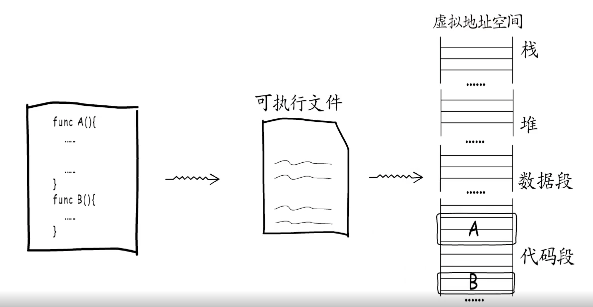

如果在一个函数中调用另一个函数，编译器就会对应生成一条 **call** 指令，程序执行到这条指令时就会跳转到被调用函数的入口处开始执行，而每个函数的最后都有一条 **ret** 指令，负责在函数结束后跳回到调用处继续执行

#### 函数栈帧

函数执行需要有足够的内存空间，供函数存放局部变量、参数、返回值等数据，这段空间对应到虚拟地址空间的栈。运行时栈上面是高地址，向下增长，栈底通常被称为 **栈基** ，栈顶又被成为 栈指针

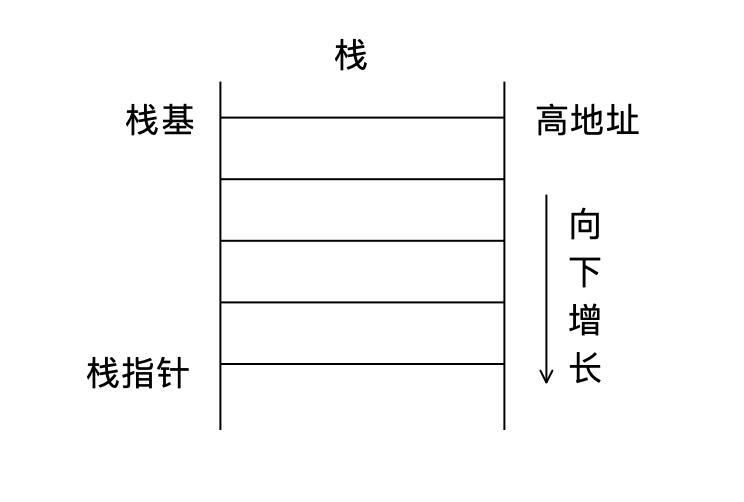

分配给函数的栈空间被称为 **函数栈帧** ，go 语言函数栈帧布局是调用者栈基地址、函数局部变量、被调用的返回值和参数

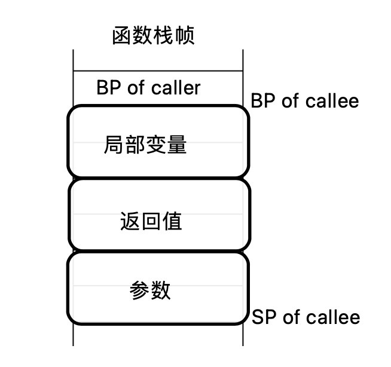

BP of callee 和 SP of callee 表示被调用函数执行时，栈基寄存器和栈指针寄存器指向的位置。我们只需要关注局部变量和参数、返回值的相对位置就好

举个例子：

```go
func A() {
    var a1, a2, r1, r2 int64
    a1, a2 = 1, 2
    r1, r2 = B(a1, a2)
    r1 = C(a1)
    println(r1, r2)
}
func B(p1, p2 int64) (int64, int64) {
    return p2, p1
}
func C(p1 int64) int64 {
    return p1
}
```

函数 A 的栈帧布局如下图，局部变量之后的空间用于存放被调用函数的返回值和参数，接下来要调用函数 B，所以现有两个 int64 类型的变量空间用作 B 的返回值，再有两个 int64 类型的变量用于存放传递给 B 的参数

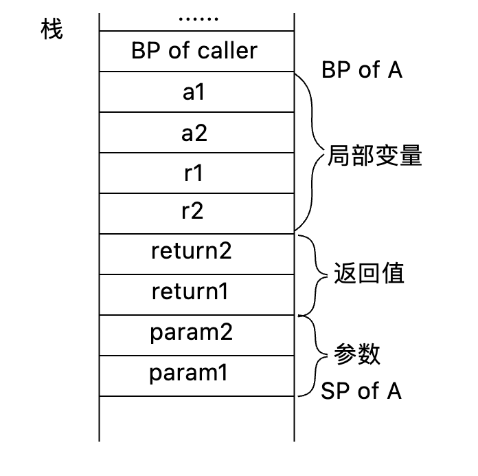

由图可以看出不论是返回值还是参数都是第二个参数先入栈。原因是被调用函数通过栈指针加上偏移量这样相对寻址的方式定位参数和返回值，这样由下至上正好先找到第一个参数再找第二个参数。

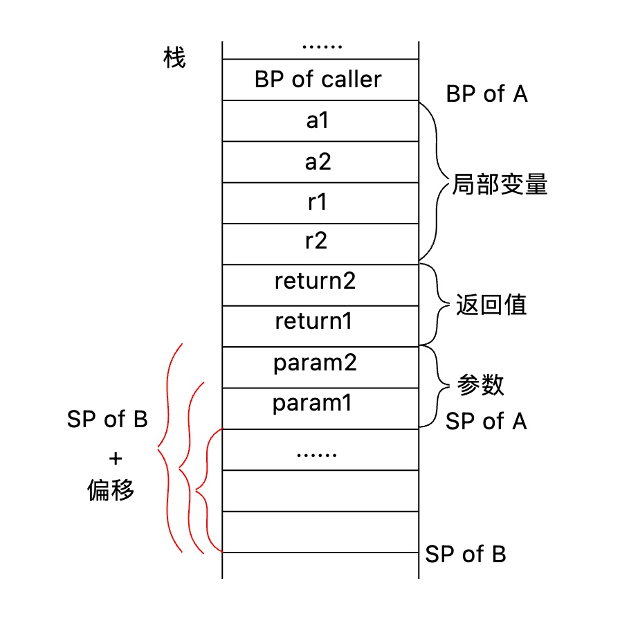

实际中对函数 B 的调用会被编译为 call 指令。实际上 call 指令只做两件事：

- 将下一条指令的地址入栈，被调用函数执行结束后回跳回这个地址继续执行，这就是函数调用的“返回地址”
- 跳转到被调用的函数 B 指令入口处执行，所以在“返回地址”下面就是函数 B 的栈帧了


所有函数的栈帧布局都遵循统一的约定，函数 B 结束后它的栈帧被释放，回到函数 A 中继续执行

Go 语言中，函数栈帧是一次性分配的，也就是在函数开始执行的时候分配足够大的栈帧空间，原因是避免栈访问越界。

#### 传参

因为 Go 是值传递，所以下面的交换函数会交换失败

```go
func swap(a,b int) {
    a,b = b,a
}
    
func main() {
    a,b := 1,2
    swap(a,b)
    println(a,b)  //1,2
}
```

main 函数栈帧如下，a、b 进行值拷贝

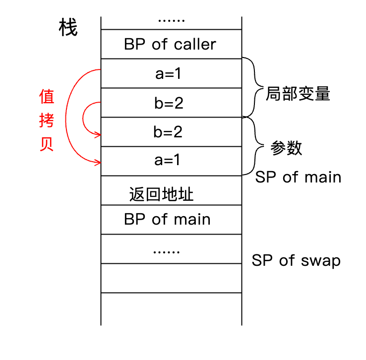

值拷贝导致交换的是参数空间中的 a、b

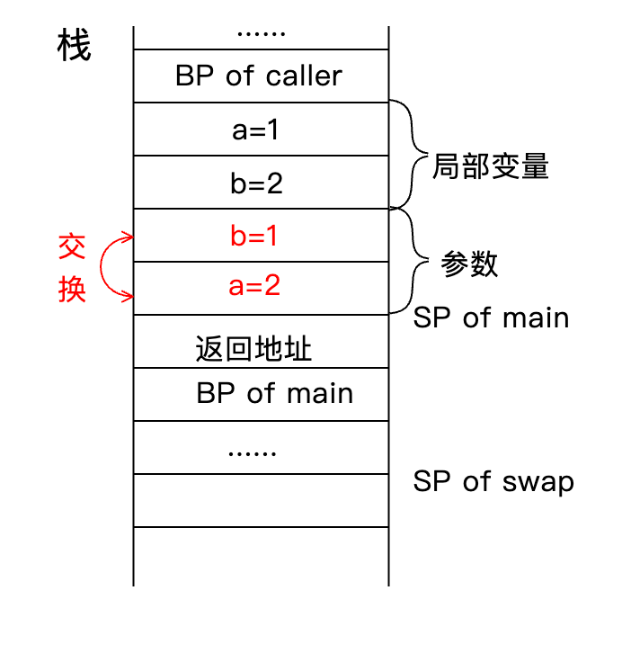

所以想要交换成功需要参数需要传递指针

#### 返回值

直接看看下面的例子

```go
func incr(a int) int {
    var b int
    
    defer func(){
        a++
        b++
    }()
    
    a++
    b = a
    return b
}
func main(){
    var a,b int
    b = incr(a)
    println(a,b) //0,1
}
```

a++ 执行前栈帧如下：


a++, b=a 执行后：


b=a 执行完成后引出一个问题，return 和 defer 哪个先执行？

答案是先执行返回值的赋值，再执行 defer，再返回

先把返回值进行赋值：

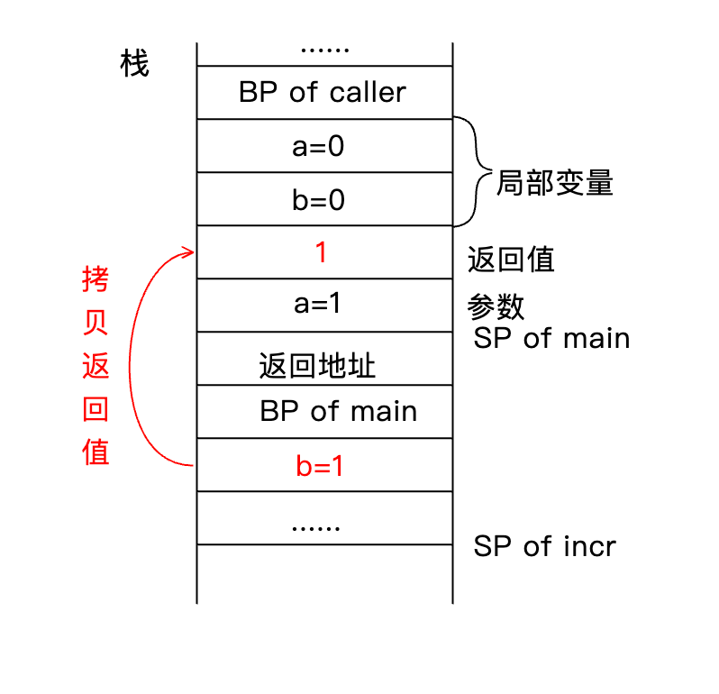

执行 defer 函数：

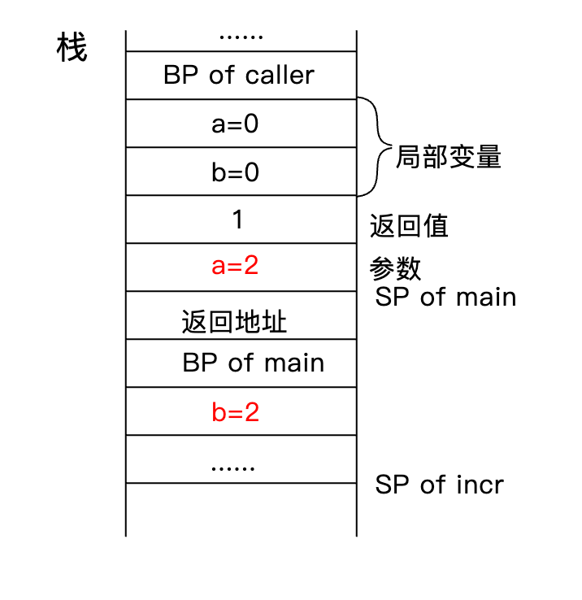

上面是匿名返回的情况，下面举个命名返回的例子，看看其中的不同

```go
func incr(a int) (b int) {
    defer func(){
        a++
        b++
    }()
    
    a++
    return a
}
func main(){
    var a,b int
    b = incr(a)
    println(a,b) //0,2
}
```

函数 incr 执行到 return a 时的操作为 将 a 赋值给 b：

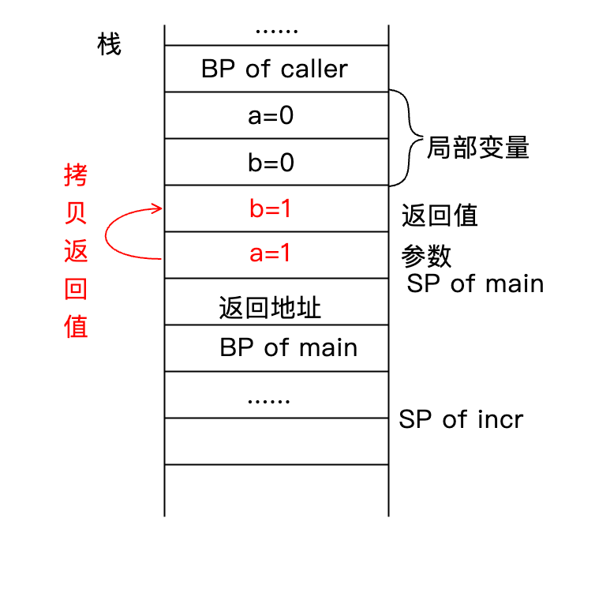

再执行 defer 函数，a、b 再自增 1，返回值最终为 2

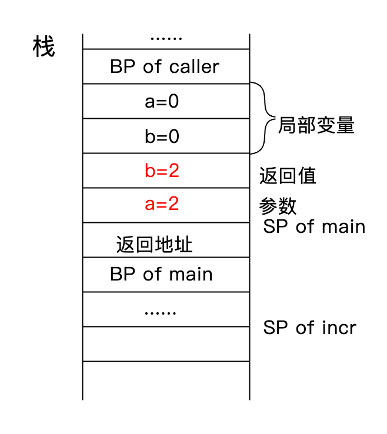

#### 函数跳转与返回

首先解释一个寄存器 BP、SP、IP，BP 为栈基，SP 为栈指针，IP 为要执行指令的指针(指令指针)

函数的跳转与返回主要是由 call 和 ret 指令实现，用下面例子来说明：

```go
func A(){
    a,b := 1,2
    B(a,b)
    return
}
func B(c,d int){
    println(c,d)
    return
}
```

调用函数 B 之前函数 A 的栈帧如下，a1 为 call 指令的地址，b1 为函数 B 的入口

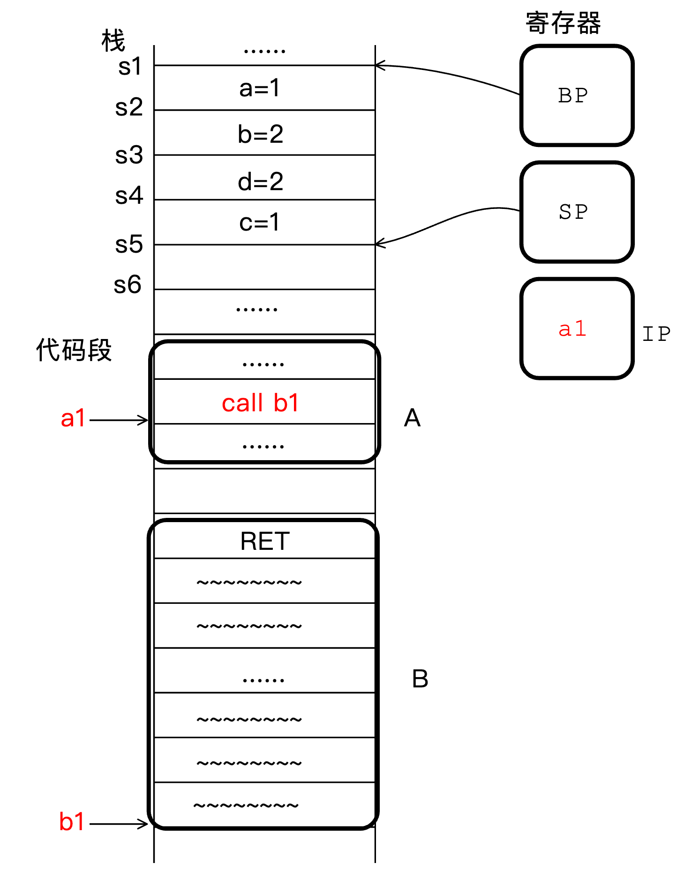

执行到 call 指令时，执行两个动作：

- 把返回地址 a2 入栈保存
- 跳转到函数 B 的入口 b1 处

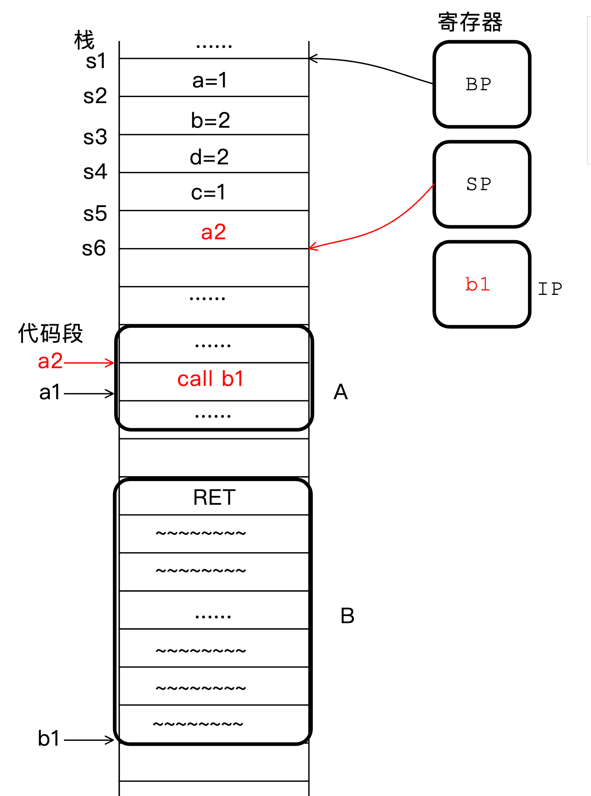


call 指令结束后，函数 B 开始执行，最开始执行的三条指令如下：

- 把 SP 向下移动 24 字节，为自己分配足够大的栈帧
- 把调用者栈基 s1 存入 SP+16 的位置
- 把 s7 赋值给 BP

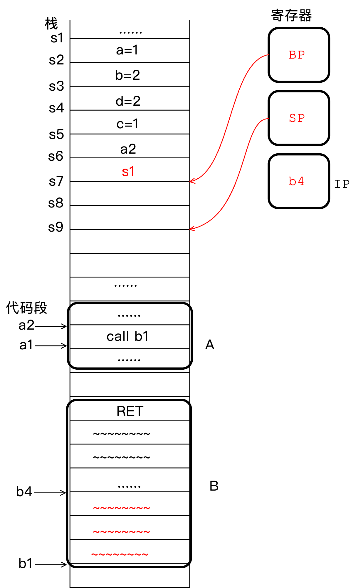

在函数 B 执行到 ret 指令之前，编译器还会插入两条指令：

- 恢复调用者 A 的栈基地址，BP 回到 s1
- 释放自己的栈帧空间，分配时向下移动多少(s6->s9)，释放时就向上移动多少

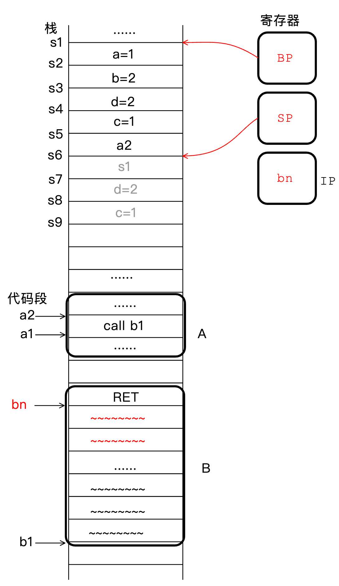

最后到 ret 指令，ret 主要执行两个操作：

- 弹出 call 指令压栈的返回地址 a2
- 跳转到 call 指令压栈的返回地址 a2

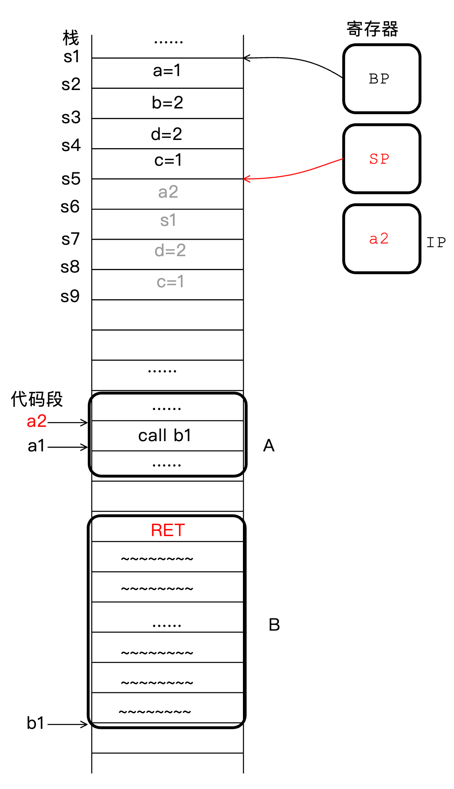


然后就可以从 a2 这里继续执行了。简单来讲，函数通过 call 指令实现跳转，而每个函数开始时会分配栈帧，结束前又释放自己的栈帧，ret 指令会把栈恢复到 call 之前的样子，通过这些指令的配合最终实现了函数跳转与返回

### 闭包

闭包=匿名函数+它所处的环境（引用外部变量）

TestClosures2 中 f1 和 f2 已经脱离了 square 函数，但是还能使用 局部变量 n，称变量 n 为捕获变量。每个闭包对象都要保存自己的捕获变量

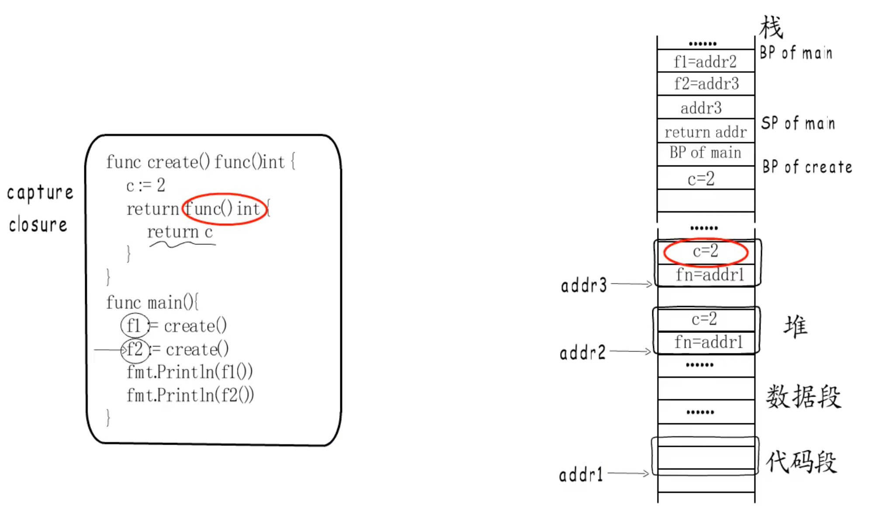

f1 和 f2 分别指向 addr 2 和 addr 3，各自维护各自的捕获变量

闭包示例：

```go
// 普通闭包
func TestClosures1(t *testing.T) {
	n := 0
	f := func() int{
		n++
		return n
	}
	fmt.Println(f())			// 1
	fmt.Println(f())			// 2
}

func square() func()int{
	n := 0
	return func() int{
		n++
		n*=n
		return n
	}
}

// 闭包作为函数返回值
func TestClosures2(t *testing.T) {
	f1 := square()
	f2 := square()
	fmt.Println(f1())				// 1
	fmt.Println(f1())				// 4
	fmt.Println(f2())				// 1
	fmt.Println(f2())				// 4				原因是 f1 和 f2 处于不同的环境
}

// 并发下的闭包
func TestClosures3(t *testing.T) {
	var wg sync.WaitGroup
	for i := 1; i <= 5; i++ {
		wg.Add(1)
		go func() {
			fmt.Println(i)
			wg.Done()
		}()
	}
	wg.Wait()
  // 5
  // 5
  // 5
  // 5
  // 5
  // 原因是 goroutine 的创建速度比循环的执行速度慢很多，因此 每个 goroutine 执行的时候 i 都是 5
}

// 验证 3 的原因
func TestClosures4(t *testing.T) {
	var wg sync.WaitGroup
	for i := 1; i <= 5; i++ {
		wg.Add(1)
		go func() {
			fmt.Println(i)
			wg.Done()
		}()
		time.Sleep(1*time.Second)
	}
	wg.Wait()
  // 1 2 3 4 5
}

// 共享变量作为闭包参数传递
func TestClosures5(t *testing.T) {
	var wg sync.WaitGroup
	for i := 1; i <= 5; i++ {
		wg.Add(1)
		go func(i int) {
			fmt.Println(i)
			wg.Done()
		}(i)
	}
	wg.Wait()
  // 5 3 4 1 2  // 顺序不同是因为每个 goroutine 执行不同 
}

// 闭包测试
func TestClosures6(t *testing.T) {
	f1 := Fox{
		v1: 11,
		v2: 11,
	}
	f2 := Fox{
		v1: 22,
		v2: 22,
	}

	test := make([]Fox, 0, 100000*2)
	for i := 0; i < 100000; i++ {
		test = append(test, []Fox{f1, f2}...)
	}

	for _, fox := range test {
		go func() {
			if fox.v1 != fox.v2 {
				fmt.Println(fox)
			}
		}()
	}
  // 出现很多{22 11}和{11 22} 原因是赋值行为本身不是原子性的
}
```

