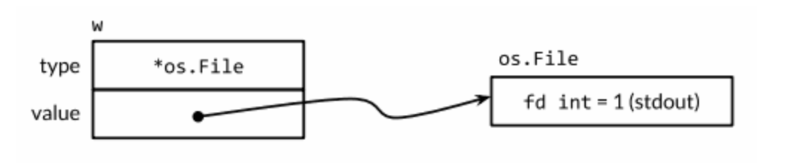
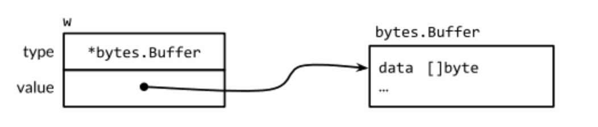
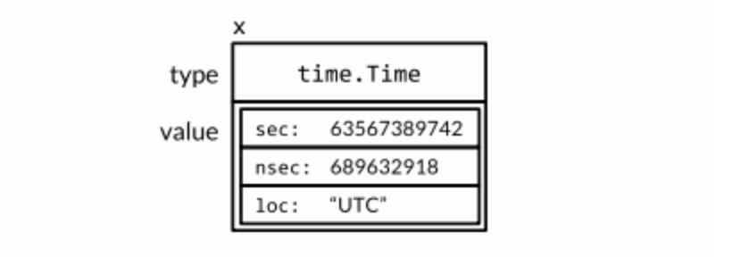
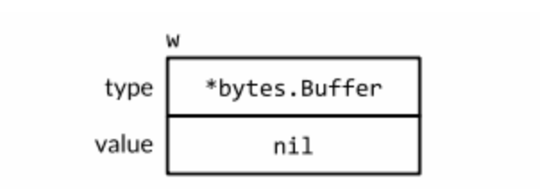

# Go Interface

### 接口的定义

接口是对一种行为的抽象，是一种合约。一个接口由数个方法组成

```go
type Sayer() interface {
  say()
}

type cat struct {}
type dog struct {}

//dog和cat实现接口
func (d dog) say() {		//因为Sayer接口中只有一个方法，因此只需要实现一个就行
  fmt.Println("汪汪汪")
}
func (c cat) say() {
  fmt.Println("喵喵喵")
}

// 接口内嵌	相当于是一种简写的形式，不用声明所有的方法
type People interface {
  Sayer
  Action(s string)
}
```

### 接口的实现

一个类型如果拥有一个接口需要的所有方法，那么这个类型就实现了这个接口。例如，`*os.Flie`类型实现了 `io.Reader、Writer、Closeer等`

接口指定的规则非常简单：表达一个类型属于某个接口只要这个类型实现了这个接口。所以：

```go
var w io.Writer
w = os.Stdout							// OK *os.Flie 实现了 Writer 接口
w = new(bytes.Buffer)			// OK *bytes.Buffer 实现了 Writer 接口
w = time.Second						// 编译失败

var rwc io.ReadWriterCloser
rwc = os.Stdout 					// OK *os.Flie 实现了 Read，Write，Close 方法
rwc = new(bytes.Buffer)		// 编译错误 Close 方法没有被实现

// 指定规则也适用于两个接口类型之间
w = rwc										// OK io.ReadWriteCloser 实现了 Write 方法
rwc = w										// 编译报错， Writer 没有实现 Close 方法
```

在实现接口的方法时，方法的接受者可以是类型 T 本身或者类型 T 的指针，**只要两个其中一个实现了方法则在调用时两个都可以调用，编译器会隐式的帮我们进行 &/* 操作。**但这仅仅是一个语法糖：T 类型实际上并没有拥有 *T 的方法，例如：

```go
type IntSet struct{/* ... */}
func (*IntSet) String() string
var _ = IntSet{}.String()				// 编译报错
```

因为语法糖的缘故我们可以使用 IntSet 调用 String 方法：

```go
var s IntSet
s.String()				// OK 编译器会帮忙加上 &s
```

但是，由于 只有 *IntSet 实现了 String() 方法，所以只有 *IntSet 可以被赋值：

```go
var _ fmt.Stringer = &s 				// OK
var _ fmt.Stringer = s					// 编译报错 IntSet 没有实现 String()
```

### 接口的值

从概念上来说由两部分组成，一个具体的类型和类型的值。它们被称为接口的动态类型和动态值。

下面四个语句中，变量 w 得到了三个不同的值。(开始和最后的值是相同的)

```go
var w io.Writer
w = os.Stdout
w = new(bytes.Buffer)
w = nil
```

进一步观察在每个语句后 w 变量的值和动态行为。第一个语句定义了变量 w：

```go
var w io.Writer
```

在 go 语言中，变量总是被一个定义明确的值初始化，即使接口类型也不例外。对于一个接口的零值就是它的类型和值都为 nil，如下图


一个接口值基于它的动态类型被描述为空或非空，可以使用 w==nil 或 w!=nil 来判断接口值是否为空。调用空接口值上的任意方法都会 panic

```go
w.Write([]byte("test"))	   	// panic
```

第二个语句将一个 `*os.File`类型的值赋给变量 w：

```go
w = os.Stdout			// os.Stout 是一个返回 *Flie 的func
```

这个赋值过程调用了一个具体类型到接口类型的隐式转换，这个直接使用 io.Writer(os.Stdout) 是等价的。这类转换不管是显示还是隐式的，都会刻画出操作到的类型和值。这个接口值的动态类型被设为 `os.File`指针的类型描述符，他的动态值持有 os.Stdout 的拷贝；这是一个代表处理标准输出的 os.Flie 类型变量的指针。



调用一个包含 `*os.Flie`类型指针的接口值的 Write 方法，使得`(*os.Flie).Write`方法被调用。

```go
w.Write([]byte("test"))				// "test"
```

第三个语句给接口赋值了一个`*bytes.Buffer`。

```go
w = new(bytes.Buffer)
```

现在的动态类型是`bytes.Buffer`并且动态值是一个指向新分配的缓冲区的指针



Write 方法的调用和之前一样：

```go
w.Write([]byte("test"))			// 将 "test" 写入 buffer 中
```

最后将 nil 赋值给接口值。

```go
w = nil
```

这个重置将它所有的部分都设为 nil，恢复到了最初的状态

一个接口值可以持有任意大的动态值。例如，time.Time 类型。

```go
var x interface{} = time.Now()
```



### 警告

**一个不包含任何值的 nil 接口值和一个刚好包含 nil 指针的接口值是不同的，下方代码会直接 panic**

```go
	var w io.Writer
	w = (*bytes.Buffer)(nil)
	if w != nil {
		_, _ = w.Write([]byte("test"))
	}
```

w 是一个包含空指针的非空接口，因此 if w!=nil 的接口仍然是true。对于一些如 `*os.Flie`的类型，nil 是一个有效的接受者，但是`*bytes.Buffer`类型不是这种，当它尝试去获取缓冲区的时候会 panic



## 