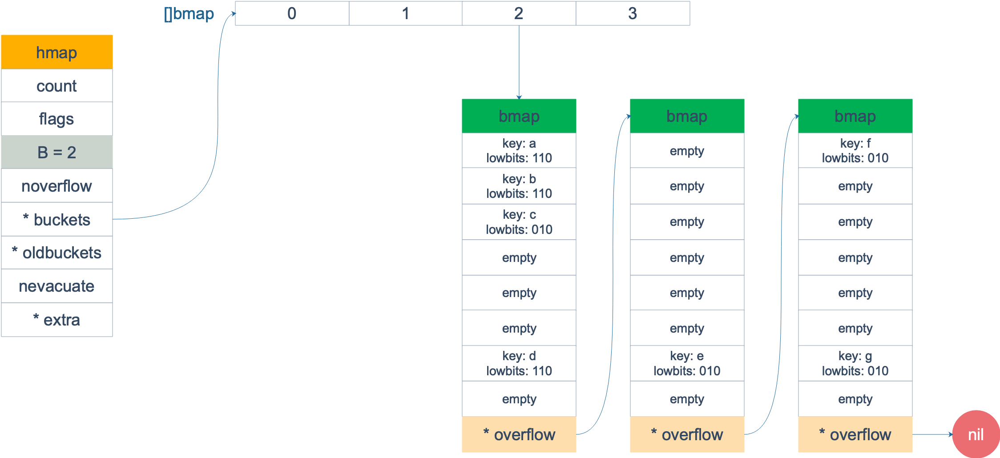
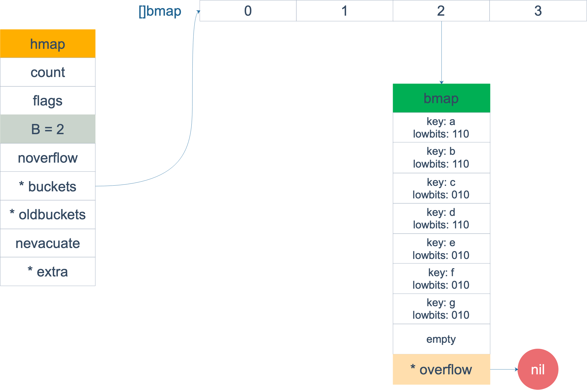

# Golang 主要问题

## 一、channel

### **什么是CSP？**

不通过共享内存来通信，而是要通过通信来实现内存共享。

这是 Go 的并发哲学，依赖于 CSP 模型，基于 channel 实现。

CSP 被认为是 Go 在并发编程上成功的关键因素。全称为 Communicating Sequential Processes 意为**通信顺序进程**，它也是 Tony Hoare 在 1978 年发表在 ACM 的一篇论文。论文里指出一门编程语言应该重视 input 和 output 的原语，尤其是并发编程的代码。

在文中，CSP 是一门自定义的编程语言，作者定义了输入输出语句，用于 processes 间的通信。processes 被认为是需要输入驱动，并且产生输出，供其他 processes 消费，processes 可以是进程、线程、甚至是代码块。输入命令是：！，用来向 processes 写入；输出是：？，用来向 processes 读出。而 Go 中的 channel 借鉴了这个设计。

Hoare 还提出了一个 -> 命令，如果 -> 左边的语句返回 false，那它右边的语句就不会执行。

通过这些输入输出命令，Hoare 证明了如果一门编程语言中把 processes 间的通信看得很重要，那么并发编程的问题就会相对变简单。

Go 是第一个将 CSP 思想引入，且发扬光大的语言。尽管内存访问控制在某些情况下有大用处，Go 里也有相应的 sync 包支持，但是这在大型程序中很容易出错。

大多数的编程语言的并发编程模型都是基于线程和内存同步访问控制，Go 的并发编程模型则用 goroutine 和 channel 来代替。goroutine 和线程类似，channel 和 mutex（用于内存同步访问控制）类似。

gouroutine 极为方便的服务了程序员，让程序员更能贴近业务思考问题，无需关注线程库、开销、调度等繁琐问题，goroutine天生就已经解决好了

Go 的并发原则非常欧秀，目标就是简单：尽量使用 channel；把 goroutine 当作免费的资源。

### channel 的数据结构是什么？

go 1.92 中 channel 的结构如下

```go
type hchan struct {
    // chan 里元素数量
    qcount   uint
    // chan 底层循环数组的长度
    dataqsiz uint
    // 指向底层循环数组的指针
    // 只针对有缓冲的 channel
    buf      unsafe.Pointer
    // chan 中元素大小
    elemsize uint16
    // chan 是否被关闭的标志
    closed   uint32
    // chan 中元素类型
    elemtype *_type // element type
    // 已发送元素在循环数组中的索引
    sendx    uint   // send index
    // 已接收元素在循环数组中的索引
    recvx    uint   // receive index
    // 等待接收的 goroutine 队列
    recvq    waitq  // list of recv waiters
    // 等待发送的 goroutine 队列
    sendq    waitq  // list of send waiters
    // 保护 hchan 中所有字段
    lock mutex
}
```

channel 的**读写都是用 lock 来保证原子性的**


新建 channel 是通过 makechan 函数创建的，源码如下：

```go
const hchanSize = unsafe.Sizeof(hchan{}) + uintptr(-int(unsafe.Sizeof(hchan{}))&(maxAlign-1))
func makechan(t *chantype, size int64) *hchan {
    elem := t.elem
    // 省略了检查 channel size，align 的代码
    // ……
    var c *hchan
    // 如果元素类型不含指针 或者 size 大小为 0（无缓冲类型）
    // 只进行一次内存分配
    if elem.kind&kindNoPointers != 0 || size == 0 {
        // 如果 hchan 结构体中不含指针，GC 就不会扫描 chan 中的元素
        // 只分配 "hchan 结构体大小 + 元素大小*个数" 的内存
        c = (*hchan)(mallocgc(hchanSize+uintptr(size)*elem.size, nil, true))
        // 如果是缓冲型 channel 且元素大小不等于 0（大小等于 0的元素类型：struct{}）
        if size > 0 && elem.size != 0 {
            c.buf = add(unsafe.Pointer(c), hchanSize)
        } else {
            // race detector uses this location for synchronization
            // Also prevents us from pointing beyond the allocation (see issue 9401).
            // 1. 非缓冲型的，buf 没用，直接指向 chan 起始地址处
            // 2. 缓冲型的，能进入到这里，说明元素无指针且元素类型为 struct{}，也无影响
            // 因为只会用到接收和发送游标，不会真正拷贝东西到 c.buf 处（这会覆盖 chan的内容）
            c.buf = unsafe.Pointer(c)
        }
    } else {
        // 进行两次内存分配操作
        c = new(hchan)
        c.buf = newarray(elem, int(size))
    }
    c.elemsize = uint16(elem.size)
    c.elemtype = elem
    // 循环数组长度
    c.dataqsiz = uint(size)
    // 返回 hchan 指针
    return c
}
```

## 二、map

### map 中的 key 为什么是无序的

map 在扩容后，会发生 key 的搬迁，原来落在同一个 bucket 中的 key，搬迁后，有些 key 就会转移位置。而遍历的过程就是按照顺序遍历 bucket。搬迁后，有些 key 位置发生变化，而有些 key 原封不动，所以遍历 map 的结果就不可能按原来的顺序

按理来说，如果定义一个固定长度的 map 保证它不会发生扩容，每次遍历是不是就是有序的了。但是 go 杜绝了这种做法，这样会给新手程序员带来误解，以为这是有序的。

go 做得更绝，当我们在遍历 map 的时候，并不是固定的从 0 号 bucket 开始遍历，而是每次都从一个随机序号的 bucket 开始遍历，并且是从这个 bucket 的一个随机序号的 cell 开始遍历。这样，即使是一个写死的 map，每次遍历的顺序都不一定是一样的

### map 的数据结构

go 语言中 map 和 java 类似也是 hashmap 采用数组链表的结构，源码中结构如下：

```go
// A header for a Go map.
type hmap struct {
  count     int 	 // 元素个数，len() 函数返回的结果
	flags     uint8
	B         uint8  // bucket 以二为底的对数，也就是说 bucket 数组的长度是 2^B
	noverflow uint16 // overflow 的 buckets 的近似数
	hash0     uint32 // hash seed
	buckets    unsafe.Pointer // 指向 bucket 数组的指针，元素个数为零时为 nil
	oldbuckets unsafe.Pointer // 指向扩容前的数组，长度是 bucket 的一半
	nevacuate  uintptr        // 代表扩容进度 小于此地址的 bucket 迁移完成
	extra *mapextra // optional fields
}
```

buckets 指向的数组结构体如下：

```go
// 表面
type bmap struct {
  tohash [bucketCnt]uint8
}

//真实
type bmap struct {
  topbits [8]uint8
  keys [8]keytype
  values [8]valuetype
  pad uintptr
  overflow uintptr
}
```

bmap 就是我们所说的“桶”，桶里面最多装 8 个 key，这些 key 经过哈希算法计算后为“同一类”的。在一个桶内 key 会根据 hash 值的高 8 位 来决定 key 到底落入桶内的具体位置。结构图如下：


再来看看 hmap 中 mapextra 的作用。当一个 map 的 key 和value 都不包括指针时，并且 size 都小于 128 字节的情况下，会把 map 标记为不含指针的，可以避免 gc 时扫描整个 hmap。此时会把 bmap 中的 overflow 指针移动到 extra 中去。


上图为 bucket 的内存模型，`HOB Hash`就是 top hash。可以看出 key 和 value 是各自放在一起的，并不是 `key/value/key/value/...`的形式，这么做的好处为有时会省掉 padding 字段，节省空间

每个 bucket 最多只能放 8 个 key-value，如果有第 9 个 key-value 落入当前 bucket，会再新建一个bucket 用 overflow 指针连接

### map 的创建

map 的创建具体实现如下：src/runtime/map

```
func makemap(t *maptype, hint int, h *hmap) *hmap {
   mem, overflow := math.MulUintptr(uintptr(hint), t.bucket.size)
   if overflow || mem > maxAlloc {
      hint = 0
   }

   // initialize Hmap
   if h == nil {
      h = new(hmap)
   }
   h.hash0 = fastrand()

   // 初始化 B 使得 B 在正常的装载因子的范围内
   B := uint8(0)
   for overLoadFactor(hint, B) {
      B++
   }
   h.B = B

   // 初始化 bucket，如果 B 等于 0 则在赋值时再分配
   if h.B != 0 {
      var nextOverflow *bmap
      h.buckets, nextOverflow = makeBucketArray(t, h.B, nil)
      if nextOverflow != nil {
         h.extra = new(mapextra)
         h.extra.nextOverflow = nextOverflow
      }
   }

   return h
}
```

### map 的扩容

使用 hash 的目的就是要快速查找到目标，然而随着 key 越来越多，key 发生碰撞的概率也就越大。当 8 个 bucket 被塞满后，crud 的效率也就会越来越低。效率最高的时候是一个 bucket 只装一个 key，查询效率就是 O(1)，但这对于空间的消耗太高，**空间换时间代价过高**

go 语言一个 bucket 中默认装 8 个 key，通过 hash 先找到 bucket 然后再定位具体的 key，实际上又是一步时间换空间的操作

为了避免链表过长使 效率变为 O(n)，因此需要引入一个`装载因子`，定义如下：

`loadFactor := len(map)/len(bucket) `

而触发扩容的时机为：对 map 进行赋值操作时，会进行条件检测，符合如下条件的其中一个就会触发扩容：

- 装载因子大于默认阈值（13/2=6.5）
- overflow 的 bucket 的数量过多

map 的赋值函数的部分源码如下：

```
func mapassign(t *maptype, h *hmap, key unsafe.Pointer) unsafe.Pointer{
	// ...

	// 没有正在扩容&&是否需要扩容
	if !h.growing() && (overLoadFactor(h.count+1, h.B) || tooManyOverflowBuckets(h.noverflow, h.B)) {
		hashGrow(t, h)
		goto again // Growing the table invalidates everything, so try again
	}

}

// 是否超过装载因子
func overLoadFactor(count int, B uint8) bool {
	return count > bucketCnt && uintptr(count) > loadFactorNum*(bucketShift(B)/loadFactorDen)
}

// 是否有太多溢出的
func tooManyOverflowBuckets(noverflow uint16, B uint8) bool {
	if B > 15 {
		B = 15
	}
	return noverflow >= uint16(1)<<(B&15)
}
```

- 超过装载因子表示平均下来几乎每个桶中都装入了超过 6.5 个 key，都快装满了所以要扩容啦
- 太多溢出表示已经溢出的 bucket 几乎都要比没有溢出的 bucket 数量多了，**例如，先插入很多元素使 bucket 变多(也意味着溢出增多)，再删除元素，这样就始终不能触发超过装载因子**。这种情况效率低下是因为 bucket 太多导致 key 太过于分散

两种情况都会触发扩容，但策略并不相同，源码如下：

```go
func hashGrow(t *maptype, h *hmap) {
   bigger := uint8(1)
   // 不是因为超过装载因子则容量大小不会发生变化
   if !overLoadFactor(h.count+1, h.B) {
      bigger = 0
      h.flags |= sameSizeGrow
   }
   oldbuckets := h.buckets		// oldbuckets 赋值为当前 bucket
   newbuckets, nextOverflow := makeBucketArray(t, h.B+bigger, nil) // 创建新 bucket

   flags := h.flags &^ (iterator | oldIterator)
   if h.flags&iterator != 0 {
      flags |= oldIterator
   }
   // commit the grow (atomic wrt gc)
   h.B += bigger
   h.flags = flags
   h.oldbuckets = oldbuckets
   h.buckets = newbuckets
   h.nevacuate = 0		// 迁移进度为0
   h.noverflow = 0

   if h.extra != nil && h.extra.overflow != nil {
      // Promote current overflow buckets to the old generation.
      if h.extra.oldoverflow != nil {
         throw("oldoverflow is not nil")
      }
      h.extra.oldoverflow = h.extra.overflow
      h.extra.overflow = nil
   }
   if nextOverflow != nil {
      if h.extra == nil {
         h.extra = new(mapextra)
      }
      h.extra.nextOverflow = nextOverflow
   }
}
```

对于第一种情况，元素太多，bucket 会直接扩容一倍，第二种情况并不会增加容量。然后将当前 bucket 赋值给 oldBucket，而新的 bucket 并没有迁移。**迁移是发生在mapassign 中的 growWork中**

迁移源码如下：

```go
func growWork(t *maptype, h *hmap, bucket uintptr) {
   // 确认迁移 oldbuckets 对应正在使用的 bucket
   evacuate(t, h, bucket&h.oldbucketmask())

   // 在迁移一个 bucket 加快进度
   if h.growing() {
      evacuate(t, h, h.nevacuate)
   }
}

// 表示旧的还没迁移完
func (h *hmap) growing() bool {
    return h.oldbuckets != nil
}
```

- 第一个 evacuate 表示将 oldbucket 中的元素迁移 rehash 到扩容后的新 bucket 中
- 第二个加一次迁移

扩容动作发生时都是以 bucket/oldbucket 为单位的，而不是 buckets/oldbuckets。结合代码分析，go map 的**扩容是增量扩容的方式，并非一步到位，原因为全量扩容时map 容量较大的话会导致扩容要消耗大量时间，增量扩容是是逐步完成的**

第一种情况因为容量增大了一倍，因此会发生 **rehash**(如原本 b=5，计算出 hash 后只需要看低 5 位，扩容后 b=6 ，计算完 hash 就得看低 6 位了，多出那一位是 0 表示位置不变，是 1 表示在新增一倍那边的同样位置)，重新分配 key 的位置，**第二种情况因为容量没有发生变化，所以只是平迁，这样会使 bmap 更加紧凑，从而减少溢出**


等量迁移前：



迁移后：



### 可以对 map 的value 取指针吗？

不可以。`cannot take the address of m["123"]`编译会报错，因为 map 发生扩容时地址会发生变化。通过 unsafe.Pointer 等获取到的地址也不能长期拥有，一旦发生扩容之前保存的地址也就随之失效


### map 重点

- 不同类型 hash 函数不一样
- 高 8 位 决定在哪个 bucket
- 低 8 位 决定 key 的位置
- 扩容为增量扩容，每次扩容一点
- map 是线程不安全的  同时对 map 的同一个元素进行读写会发生 panic


## 三、函数

### 闭包

闭包=匿名函数+它所处的环境（引用外部变量）

闭包示例：

```go
// 普通闭包
func TestClosures1(t *testing.T) {
	n := 0
	f := func() int{
		n++
		return n
	}
	fmt.Println(f())			// 1
	fmt.Println(f())			// 2
}

func square() func()int{
	n := 0
	return func() int{
		n++
		n*=n
		return n
	}
}

// 闭包作为函数返回值
func TestClosures2(t *testing.T) {
	f1 := square()
	f2 := square()
	fmt.Println(f1())				// 1
	fmt.Println(f1())				// 4
	fmt.Println(f2())				// 1
	fmt.Println(f2())				// 4				原因是 f1 和 f2 处于不同的环境
}

// 并发下的闭包
func TestClosures3(t *testing.T) {
	var wg sync.WaitGroup
	for i := 1; i <= 5; i++ {
		wg.Add(1)
		go func() {
			fmt.Println(i)
			wg.Done()
		}()
	}
	wg.Wait()
  // 5
  // 5
  // 5
  // 5
  // 5
  // 原因是 goroutine 的创建速度比循环的执行速度慢很多，因此 每个 goroutine 执行的时候 i 都是 5
}

// 验证 3 的原因
func TestClosures4(t *testing.T) {
	var wg sync.WaitGroup
	for i := 1; i <= 5; i++ {
		wg.Add(1)
		go func() {
			fmt.Println(i)
			wg.Done()
		}()
		time.Sleep(1*time.Second)
	}
	wg.Wait()
  // 1 2 3 4 5
}

// 共享变量作为闭包参数传递
func TestClosures5(t *testing.T) {
	var wg sync.WaitGroup
	for i := 1; i <= 5; i++ {
		wg.Add(1)
		go func(i int) {
			fmt.Println(i)
			wg.Done()
		}(i)
	}
	wg.Wait()
  // 5 3 4 1 2  // 顺序不同是因为每个 goroutine 执行不同 
}

// 闭包测试
func TestClosures6(t *testing.T) {
	f1 := Fox{
		v1: 11,
		v2: 11,
	}
	f2 := Fox{
		v1: 22,
		v2: 22,
	}

	test := make([]Fox, 0, 100000*2)
	for i := 0; i < 100000; i++ {
		test = append(test, []Fox{f1, f2}...)
	}

	for _, fox := range test {
		go func() {
			if fox.v1 != fox.v2 {
				fmt.Println(fox)
			}
		}()
	}
  // 出现很多{22 11}和{11 22} 原因是赋值行为本身不是原子性的
}
```


## 四、并发

### GPM

G、P、M 是 go 调度器的三个核心组件，各司其职


# 其它问题

**1.函数参数的传递类型**

go 语言中只存在值传递，如果是非引用类型(值类型)，则传过去的是变量的拷贝值（指针的拷贝），在函数中操作并不会影响原值。如果是引用类型(array、slice、map)则传递的是指针，会修改原变量
