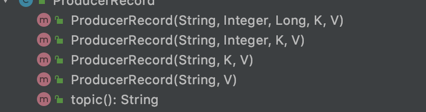

# 消息队列

# 一、消息模型

## 点对点

消息生产者向消息队列中发送一个消息后，只能被一个消费者消费一次


## 发布/订阅

生产者向消息队列中发送一个消息后，多个消费者可以从队列中订阅这条消息并消费


# 二、使用场景

## 异步处理

生产者向消息队列中发送消息后不需要等待消费者同步，而是返回去做其他事情，消费者订阅后异步处理队列中的消息(想处理的时候再处理)。例如，在注册流程中需要向用户发送验证信息保证用户身份的合法性，可以使用消息队列使发送邮箱操作一步处理

## 流量削峰

高并发情况下大量请求到达会压垮服务器，可以将请求放入消息队列中，服务器按照其处理能力进行订阅消息

## 应用解耦

通过消息队列，一个模块只需要向其中发送消息，其他模块进行选择性的订阅，从而减小耦合

## 缓冲

生产速度大于消费速度时的一个缓冲功能

# 三、kafka

## 设计目标

- 高吞吐量、低延迟：kafka每秒可以处理几十万条消息，它的延迟最低只有几毫秒
- 可扩展性：kafka集群支持热扩展
- 持久性、可靠性：消息可以持久化到磁盘上，并且支持数据备份防止数据丢失
- 高并发：支持数千个客户端同时读写
- 容错性：允许集群中节点失败

## 专用术语

- Broker：kafka包含一个或多个服务器，这种服务器被称broker
- Topic：每条被发布到kafka的消息都有类别，这个类别被称为topic，不同topic的消息分开存储
- Partition：物理上的概念，一个topic包含一个或多个partition
- Record：生产或消费消息的记录，一个记录包含key、value、timestamp
- Offset：每条Record发布到broker之后会生成一个offset，同一个partition中offset是递增的
- Producer：负责发送消息至kafka broker
- Consumer：从kafka broker消费消息
- Consumer Group：管理一组consumer实例，每个consumer属于一个特定的group

## Topic&Patition

**Topic：**可以被认为是一个queue，每个消息都必须指定属于哪个topic，相当于进哪个queue

**Partition：**一个topic物理上被分为多个partiton，每个partiton在物理机上对应一个文件夹，该文件夹存储该partition的所有消息和索引文件。分为多个partition原因是如果只有一个文件则I/O会成为这个topic的性能瓶颈，而有了partition后可以把消息放在不同broker的不同partiton中，极大的提高了并发度和吞吐量

**Offset：**每个消息都有一个64字节的offset标识位置

## 可靠性

**Replication：**为了保证可靠性一个partition可以有多个replication分布在不同的broker上

**Leader选举：**每个partiton会在多个repication中选一个leader，client读写操作都通过leader，其他的follower用来同步数据

## Producer

**分区策略：**

Java中需要将producer发送的数据封装成一个ProducerRecord对象，此对象构造函数中包含partition



- 指明了partition则直接用指明的值作为partition的值
- 未指明partition但是指明了key，则用key的hash值与partition数量取余来决定哪个partition
- 既没有指定partition也没有指明key，则第一次调用时随机生成一个值，后面每次加一，与partition数取余（round-robin算法）

**分区原因：**

- 方便集群扩展，一个topic有多个partition，从而可以适应各种大小
- 提高并发

**数据可靠性：**

每个topic中的partition收到生产者发送的消息后都会发送一个ack去确认，生产者收到ack后才会进行下一轮发送，不然重新发送。

而partition发送ack的时机是当所有（或半数）follower和leader已经同步完成后再发送ack，以保证数据同步

**副本同步策略（容错）：**

- **全部完成同步才发ack(默认)：缺点是延迟高，但是容忍n个节点出故障需要n+1个副本，延迟对于kafka影响不是很大**
- 完成半数就发ack：延迟低，但是容忍n个节点出故障需要2n+1个副本，会造成大量数据冗余
- 当个别follower**长时间未和leader同步，该follower会被踢出集合（ISR）之中**

**ack应答机制：**

对于一些对于数据的可靠性要求不是太高，可以容忍一些数据丢失没有必要等ISR中所有follower全部接收成功，因此kafka提供了三种可靠级别。通过acks参数配置：

- 0：producer不需要等待服务器（leader）应答，也不保证服务器能收到数据，可能发生数据丢失
- 1：leader收到应答就算成功，若还没和follower同步完成leader故障，则也可能丢失数据
- -1：所有partition都同步完成后才返回ack，但是如果同步完成后broker发送ack前leader故障则会导致数据重复

**故障处理细节：**

LEO：每个副本中最大的offset

HW：所有副本中最小的LEO（HW前的数据才能被consumer看见）

- follower故障：follower故障时会先被提出ISR，待恢复时会读取故障前的HW，将HW后的数据截掉，然后同步leader数据，当LEO和HW相同时（追上）就再次加入ISR
- leader故障：leader故障后会从ISR中重新选取一个leader，为保证副本之间的数据一致性，则会将其他follower高于HW的部分截掉，都从新leader同步。（不能保证数据不丢失，只能保证数据一致）

## Consumer

**消费方式：**

kafka的消费方式pull（拉），pull模式的不足是当队列中没有数据时会一直返回空数据。可以通过传一个timeout，即拿不到数据则consumer会等待一段时间再返回。

**Offset维护：**

因为consumer在消费时可能会发生断电宕机等事故，因此需要维护一个offset来记录消费到哪里了，恢复时从哪里开始。offset由consumer gruop+topic+partition确定

**分区分配策略：**消息从producer写入borker的分配原则

- Range(默认)：对于每个topic而言，先将分区按照序号排序，然后把消费者按照字母排序。每个消费者的分区为，分区数/消费者数，余出来的数量分给前面的消费者。例如10个分区3个消费者，第一个分0，1，2，3，第二个分4，5，6，第三个分7，8，9。问题是每个topic前几个都多出一个，最终导致消费的差距较大

- RoundRobin：

    需要满足两个条件

    - 同一个consumer group中的消费者num.streams必须相同

    - 每个消费者订阅的topic必须相同

        将多个topic分成TopicAndPartition，每个TopicAndPartition按照hashcode进行排序。然后依次分给每个消费者。如分区排完序为5、7、2、1、4、3、8、6、9、0，则先给一号消费者分5，二号分7，三号分2，一号分1，二号分4....以此类推

## 同步异步发送

- 发布并忘记：发送完直接返回，不care结果，kafka内部有重发机制
- 同步发送：调用send方法后返回future对象，调用get方法等待
- 异步发送：send方法指定一个回调函数，返回时回调该函数，回调函数工作在kafka线程中，因此避免在回调函数中做繁重的事情，避免影响发送

## 事务

**Producer事务：**

想要实现跨分区的事务，就需要引入全局唯一的Transaction ID，并将Producer的PID与之绑定。因此当Producer重启时就可以通过TID获得原来的PID。

为了管理Transaction，kafka引入了一个Transaction Coordinator组件。producer就是通过和Transaction Coordinator交互获得TID对应的状态，Transaction Coordinator还负责将事务写入kafka内部的一个topic，即使整个服务重启，事务也会得到保存

**Consumer事务：**

consumer的事务保证相对较弱，因为consumer可以通过offset访问任意信息，同一事务重启后也可能出现被删除的情况

## Producer API

**消息发送流程：**

producer是通过异步发送数据的，涉及到main和sender线程，以及一个线程共享变量RecordAccumlator。main线程把消息发送到RecordAccumlator，sender线程从中取消息发送到kafka broker

**流程图：**


**参数：**

batch.size：只有消息数量达到batch.size sender才会发送消息

linger.ms：当数量经过linger.time时还没达到batch.size，则会直接发送消息

## 异步发送 API

```java
//不带回调函数的API
public class CustomProducer {
    public static void main() thorws ExecutionException, InterruptedException {
        Properties props = new Properties();
        
        //kafka集群
        props.put("bootstrap.servers","xxxx");
        props.put("acks", "all");
        ...
        Producer<String, String> producer = new KafkaProducer<>(props);
        for(int i = 0; i < 100; i++) {
            producer.send(new ProducerRecord<String, String>("first", Integer.toString(i),Integer.toString(i)));
        };
        prducer.close();
    }
}
//带回调函数的
public class CustomProducer {
    public static void main() thorws ExecutionException, InterruptedException {
        Properties props = new Properties();
        
        //kafka集群
        props.put("bootstrap.servers","xxxx");
        props.put("acks", "all");
        ...
        Producer<String, String> producer = new KafkaProducer<>(props);
        for(int i = 0; i < 100; i++) {
            producer.send(new ProducerRecord<String, String>("first", "123"), new Callback() {
            //回调函数，该函数会在producer收到ack后执行
            @Override
            public void onCompletion(RecordMetadata recordMetadata, Exception e) {
                if (e == null) {
                    System.out.println("success:offset=" + recordMetadata.offset());
                }else {
                    e.printStackTrace();
                }
            }
        });
        prducer.close();
    }
}
```

## 同步发送 API

```java
public static void main(String[] args) throws ExecutionException, InterruptedException {
	Properties props = new Properties(); 					//kafka集群
    props.put("bootstrap.servers","xxxx");
    props.put("acks", "all");
    ...
	Producer<String, String> producer = new KafkaProducer<>	   (props);
	for (int i = 0; i < 100; i++) {
		producer.send(new ProducerRecord<String, String>("first", Integer.toString(i), Integer.toString(i))).get();
    }
	producer.close(); 
}
```

## Customer API

和上面差不多

## 拦截器

使用用户在消息发送前、回调逻辑前对消息进行处理，方法如下：

- configure(configs)：获取配置信息和初始化数据时调用
- onSend(ProducerRecord)：该方法封装进KafkaProducer.send方法中，即它运行在主线程中。Producer确保在消失被序列化以及计算分区前调用该方法。**用户可以在此方法中对消息进行任何处理，但是最好不要修改消息所属的topic和分区，否和会影响目标分区的计算**
- onAcknowledgement(RecordMetadata, Exception)：该方法会在消息从RecordAccumlator成功发送到broker后，或者发送失败时调用。通常是在回调逻辑之前，该方法运行在producer的IO线程中，因此不要在该方法中加入太过于沉重的逻辑，否则会影响producer发送消息的效率
- close：一般用于资源清理

**使用：**自己定义好拦截器类，利用props加入进去


