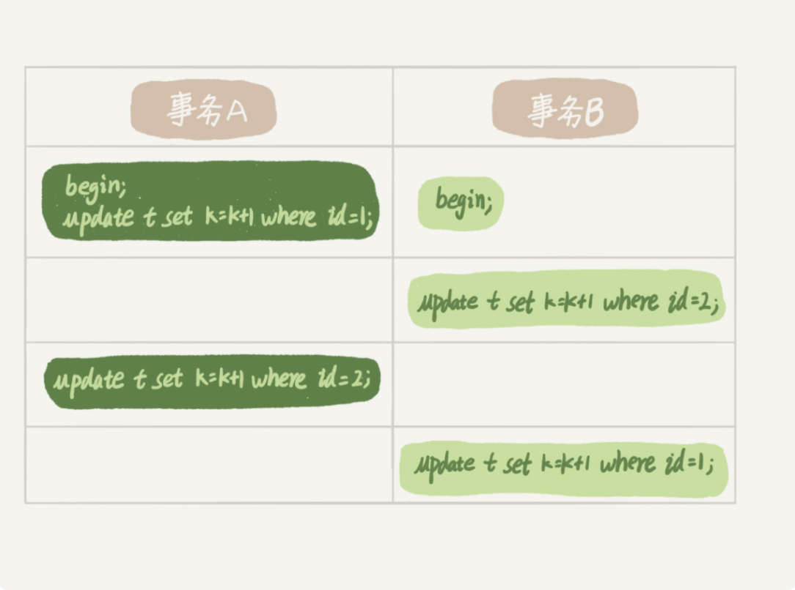

# MySQL

# 一、一条 SQL 查询语句是如何执行的

## MySQL 基本架构示意图


整体来说，MySQL 可以分为 Server 层和存储引擎层

Server 层包含**连接器、查询缓存、分析器、优化器、执行器**等，涵盖了 MySQL 大多数核心服务功能，以及所有的内置函数(如日期、时间、数学、加密等)，所有跨存储引擎的的功能都在这一层实现，如视图、存储过程、触发器等

而存储引擎层是负责数据的存储和提取，其架构模式是插件式的，支持 InnoDB、MyISAM、Memory等多个存储引擎。目前最常用的存储引擎是 InnoDB，MySQL 从 5.5.5 版本开始默认的存储引擎就是 InnoDB，即在 create table 时不指定存储引擎，则默认就是 InnoDB，也可以显示的用 engine = memory 来指定存储引擎，不同的存储引擎共用同一套 Server 层

## 具体流程

### 连接器

第一步，你会先连接数据库，此时接待你的就是连接器。连接器负责和客户端建立连接、获取权限、维持和管理连接，连接命令如下：

```mysql
mysql -h$ip -P$post -u$user -p
```

输入完后系统会让你输入密码，当然也可以在 -p 参数后直接加上密码，但是不建议这样(不安全)

在完成经典的 TCP 的三次握手后，连接器就要开始认证你的身份了(用你输入的账号密码)

- 如果输入的账号密码不正确，则会收到一个 `Access denied for user` 的错误，然后客户端程序结束
- 如果账号密码都正确，则连接器会去权限表中查询该用户的权限，在此之后的权限判断都依赖于此时查询出的权限，这就意味着哪怕管理员账号对这个用户的权限进行了修改也不会影响已经建立的连接。修改后的权限只有在新的连接中才会生效

在数据库中，长连接是指连接成功后，如果客户端持续有请求，则一直使用同一个连接。短连接是指一次连接仅执行很少的的几次查询就断开连接了，下次查询则新建一个连接

建立连接是需要消耗资源的，因此需要尽量少的建立连接，也就是尽量使用长连接

但是全部使用长连接后，可能会导致内存涨的很快。原因是 MySQL 在执行过程中使用的内存是和管理在连接对象中的。这些资源会在连接断开时才会释放。因此长连接可能会导致内存占用过高从而导致 OOM

解决方案：

- 定时断开长连接，等再次查询时再连接上
- 在 MySQL 5.7 版本后可以在每次执行完一个较大的操作后通过执行 mysql_reset_connection 来初始化连接资源。**这个过程不需要重连以及权限校验，会讲连接还原到刚连接的时刻**

### 查询缓存

连接建立完成后，就可以执行查询语句了，执行逻辑就来到了第二步**查询缓存**

MySQL 拿到一个查询请求后会先去查询缓存，命中缓存则直接返回结果。没在缓存中才会执行后续逻辑，但是多数情况下不建议使用缓存，因为每当一个更新操作被执行后缓存都会被清空，缓存的失效率较高。**需要注意的是 MySQL 8.0 版本直接将查询缓存功能删除了**

### 分析器

如果没有命中缓存，就要真正开始执行查询语句了。首先 MySQL 需要知道你要做的是什么，因此需要对 SQL 语句进行解析

分析器会先进行**词法分析**，用户输入的是多个字符串由空格分隔，MySQL 需要识别出每个字符串都分别是什么，代表些什么。例如，MySQL 会从你输入的 “select” 中识别出这是一个查询语句，从后面 “ID” 识别出这对应的是列 ID

做完识别后则会进行**语法分析**。根据词法分析的结果分析器会根据语法规则来校验 SQL 语句是否符合语法规则。如果语句不对则会提醒你 `You have an error in your SQL syntax`错误

### 优化器

优化器是在查询时有多个索引时选择使用哪个索引以及多表 join 时选择查询顺序，在逻辑结果相同的情况下选择效率高的一个

### 执行器

MySQL **通过分析器知道你想做什么，通过优化器知道了该怎么做**，接下来就到了执行阶段了

开始执行时会先判断你有没有这个表的权限，没有权限则返回无权限的错误。有权限的话会打开表继续执行，在打开表的时候执行器会根据表的引擎定义去使用这个引擎提供的接口

```sql
select * from test where id = 10
```

例如 test 表中 id 列不是索引，那么执行器的执行顺序如下：

1. 调用 InnoDB 引擎接口获取这个表的第一行，判断 id 值是不是 10 ，不是则跳过，是则加入结果集
2. 调用下一行接口，重复判断逻辑，以此类推
3. 执行器将上述遍历过程取得的结果集返回

至此，一条语句就执行完成了。对于有索引的列逻辑也差不多只是调用的接口不同罢了

# 二、一条更新语句是如何执行的

```sql
update test set c = c + 1 where ID = 2
```


执行更新语句和查询语句前面大致相同，先连接数据库（连接器）

对了当一个表被更新时会先删除所有缓存，因此这条更新语句会将缓存清空，这也是不建议使用查询缓存的原因

接下来分析器分析出这是一条更新语句。优化器决定使用 ID 这个索引。然后执行器负责具体执行，找到这一行然后更新，与查询流程不同的是更新流程还涉及到两个重要的**日志模块（redo log、binlog）**

### 重要的日志模块：redo log

更新操作每次都需要写到磁盘上并且还需要找到对应那一条的位置再更新，整个过程 IO 和查找成本都很高。为了解决这个问题 MySQL 引入了一个中间过程，在不忙的时候先将记录记录在一个地方等不忙时再更新入磁盘

MySQL 中使用的是 WAL(Write-Ahead Logging)技术来实现的，关键点就是先写日志再写磁盘。具体来说就是，当有一条记录需要更新时，InnoDB 引擎会先把记录写到 redo log 中并更新内存，这样就算完成了。同时，InnoDB 引擎会在适当的时候将 redo log 中的记录更新到磁盘中，这个更新往往是在系统比较空闲的时候

**如果 redo log 满了怎么办？**

InnoDB 引擎的 redo log 的大小是固定的，例如可以配置为一组四个文件，每个文件大小为 1GB 总共可以记录 4GB。写到末尾就从头开始写，如下图所示


write pos 是当前写入的位置，一边写入一边后移，写到第三个文件的末尾再往后写就到第一个文件的头部。check point 是当前要擦除的位置，也是会向后循环移动的，写入磁盘后则擦除掉。write pos 和 check point 之间则是数据写入的空间，当 write pos 追上 check point 时表示可用空间已用完，此时不能执行新的更新，需要先将 check point 往前推进一下

有了 redo log InnoDB 就可以保证即使数据库异常重启了，之前提交的数据也不会丢失，这个能力被称为 **crash-safe**

### 重要的日志模块：binlog

前面说过 MySQL 整体来看分为两块，一块是 Server 层，它负责的是功能层面的事情；还有一块是引擎层，主要负责存储相关的事情。上面提到的 redo log 是 InnoDB 引擎特有的日志，而 Server 层也有自己的日志，那就是 binlog（归档日志）

**两个日志的不同之处**

- redo log 是 InnoDB 引擎特有的，而 binlog 因为处于 Sever 层因此所有存储引擎都有
- redo log 是物理日志，记录的是 “在某个数据页上做了什么修改”，而 binlog 是逻辑日志，记录的是语句的原始逻辑，如 “ID = 2 的某列值 + 1”
- redo log 是循环写的，空间会使用完。而 binlog 是追加写的，一个文件超过一定大小后会从新写一个文件

**再来看看执行器和 InnoDB 引擎对于上面的简单的 update 语句的内部流程**

1. 执行器先找引擎 ID = 2 这一行，引擎发现 ID 列是索引，直接从索引树上找到这一行，如果 ID = 2 这一行本来就在内存中则直接返回，不存在则去磁盘中读入内存再返回
2. 执行器拿到引擎给到的行值后，把这个值 + 1 得到一行新的记录再调用引擎接口写回
3. 引擎将这行记录写入内存，同时将这个更新操作写入 redo log 中，此时 redo log 处于 prepare 状态并告知执行器执行完成了可以随时提交事务了
4. 执行器生成这个操作的 binlog，并把 binlog 写入磁盘
5. 执行器调用引擎的提交事务接口，引擎将刚刚写入的 redo log 改为 commit 状态，执行完成

流程图如下，深绿色是执行器执行的，浅绿色是 InnoDB 引擎执行的


整体看下来可能会感觉后面三步有点绕，先 prepare 后 commit 这是两阶段提交

**两阶段提交**

两阶段提交是为两个 log 的一致性，如果不使用两阶段提交，要么是先写完 redo log 再写 binlog，或者反过来

- **先写 redo log 再写 binlog**：假设在写完 redo log 后，binlog 还没写完 MySQL 宕机了。由于前面提过的即使服务器崩溃有 redo log 数据就不会丢失。但是 binlog 却没有这条 update 记录，如果用 binlog 去恢复数据库的数据时就会少掉这条记录与原库值不同
- **先写 binlog 再写 redo log**：写完了 binlog 后 redo log 没写完时宕机了，系统恢复时由于 redo log 中没有这条数据，则恢复出来的数据没有这条数据。再用 binlog 去处理数据时多了这条数据导致与原库的数据不同

# 三、事务隔离：为什么你改了我还看不见？

## 隔离性与隔离级别

提到事务肯定能想到 ACID 即原子性、隔离性、一致性和持久性，此次主要看看**隔离性**

当数据库有多个事务在执行时，可能会出现脏读、不可重复度和幻读的问题，为了解决这些问题就有了隔离级别的概念

在谈隔离级别前，首先要知道隔离的越严格则效率越低下。因此大多时候是找到其中的平衡点

**隔离级别**

- 读未提交：指一个事务还没有提交就可以被其他事务读到
- 读已提交：指的是一个事务只有提交后它所做的变更才能被其他事务读到
- 可重复读：指一个事务执行的过程中所读到的数据总是与事务开启前的数据一致
- 串行化：顾名思义串行处理，读加读锁，写加写锁。发生锁冲突时先到的事务执行完后面的事务才能拿到锁

在实现上，数据库是用**视图**来实现的，访问的时候以视图的结果为准，可重复读级别下在事务开始的时候创建一个视图，整个事务期间都使用这个视图。读已提交级别下是在每一条 sql 执行前创建一个视图。需要注意的是读未提交级别是没有视图概念的，直接返回记录上的最新值；而串行化是用锁来避免并行访问

## 事务隔离的实现

主要看看**可重复读**级别的实现。在 MySQL 中每一条更新记录都还会记录一条回滚的记录，记录了上个状态的值，通过回滚可以获得前一个状态的值

假设一个值从 1 依次被改为 2、3、4，则在回滚日志中会有类似如下日志


当前值是 4，但是查询这条记录时，不同时刻开启的事务有不同的 read-view。如图所示在视图 A、B、C 中值分别为 1、2、4，同一条记录在系统中可以存在多个版本，这就是数据库中的多版本并发控制（MVCC）。对于 read-view A 想要得到 1 就需要按图中顺序依次执行回滚操作得到值

同时可以发现，就算有其他事务再来将 4 修改成 5、6 等都不影响前面的事务

回滚日志不会一直保留，系统会在不需要时（没有比当前日志更早的 read-view 时）将日志删除。

基于以上说明，给一个建议尽量不要使用过长的事务。长事务意味着系统中会存在很老的视图，因此在这个事务提交前这些回滚日志都会存在会导致占用大量的存储空间。在 MySQL 5.5 版本之前回滚日志和数据字典一样是存储在 ibdata 文件中，即使长事务提交回滚日志清理，文件也不会变小。有些库数据只有 20GB 而回滚段却有 200GB，最终为了清理回滚段而从建整个库

## 事务的启动方式

如前面所述，长事务由这些潜在的风险，建议尽量避免。通常是因为误操作导致的。MySQL 的事务启动方式有以下几种：

- 显示启动事务语句，begin 或 start transaction。配套的提交语句是 commit，回滚语句是 rollback
- set autocommit = 0，这个命令会将这个线程的自动提交关掉。意味着如果你只执行了一个 select 语句，这个事务就启动了，而且并不会自动提交。这个事务会存在直到你主动执行 commit 和 rollback 语句或者断开连接

有些客户端连接框架默认连接成功后先执行一个 set autocommit = 0 的命令。这就导致接下来的查询都在事务中，如果是长连接就导致了意外的长事务。因此，建议总是使用 set autocommit = 1，通过显示语句来启动事务

# 四、数据库索引

一句话简单来说，**索引的出现其实就是为了提高查询效率，就像书的目录一样。**一本 500 页的书，如果你想快速找到其中的某一个知识点，在不借助目录的情况下，那估计得找很久。同样，对于数据库而言，索引其实就是他的目录

## 索引的常见模型

索引的出现是为了提高查询效率，但是实现索引的方式却有很多种，因此这里也就引入了索引模型的概念。可以用于提高读写效率的的数据结构有很多，主要介绍三种常见、简单的数据结构，分别是哈希表、有序数组和树

**哈希表**是一种以键-值（key-value）存储数据的结构，查询速度很快，但是会存在哈希冲突，利用拉链法可以解决多用于**等值查询**，如 redis、memcached 等 NoSQL 引擎

**有序数组在等值查询和范围查询场景中的性能都很优秀**，而对于修改较多的场景性能较差，因此只适用于静态**存储**引擎，例如要保存的是 2017 年某个城市的所有人口信息，这类不会再修改的数据

**树**型结构优点就是查询效率很高 O(log n) 查询复杂度

## InnoDB 的索引模型

在 InnoDB 中，表都是根据逐渐顺序以索引的形式存放的，这种存储方式的表成为索引组织表。InnoDB 引擎使用的是 B+ 树，每一个索引在 InnoDB 里对应一颗 B+ 树

假设，我们有一个主键列为 ID 的表，表中有字段 k，并且 k 列有索引

```sql
create table T(
id int primary key, 
k int not null, 
name varchar(16),
index (k))engine=InnoDB;
```

表中的 R1～R5 的(ID, k) 值分别为，(100, 1)、(200, 2)、(300, 3)、(500, 5)和(600, 6)，两颗树的示意图如下


从图中不难看出，根据叶子结点的内容，索引类型分为主键索引和非主键索引

主键索引的叶子结点存放的是**整行数据**。在 InnoDB 中主键索引也被称为聚集索引

非主键索引的叶子结点存放的是主键的值。在 InnoDB 中非主键索引也被称为二级索引

**主键索引和普通索引的查询有什么区别？**

- 如果语句是 select * from T where ID = 500，即主键查询方式，则只需要搜索 ID 这颗 B+ 树
- 如果语句是 select * from T where k = 5，即普通索引查询方式，则需要先搜索 k 索引树，得到 ID = 500，再到 ID 索引树在搜索一次，这个过程称为回表

也就是说非主键索引的查询方式要多扫描一颗索引树，因此在应用中应该尽量使用主键查询

## 索引维护

B+ 树为了维护索引有序性，在插入新值的时候需要做必要的维护。以上图为例，如果插入新的行 ID 值为 700，则只需要在 R5 后面插入一条新纪录。如果插入的 ID 为 400，就相对麻烦了，需要逻辑上挪动后面的数据，空出位置

而更糟糕的情况是 R5 所在的数据页已经满了，根据 B+ 树的算法，这时候需要申请一个新的数据页，然后挪动部分数据过去。这个过程称为页分裂。在这种情况下，性能自然会受到影响

除了性能外，页分裂操作还影响数据页的利用率。原本在一个页的数据，现在分裂到两个页汇总，整体空间利用率降低大约 50%

当然有分裂就有合并，合并发生在删除操作中，可以认为是分裂的逆过程

基于上述的索引维护过程说明，来讨论一个案例：

> 在某些规范中可能见到过，要求建表语句里一定要有自增主键。当然事无绝对，我们来分析下哪些场景下需要使用自增主键，哪些场景不需要

插入新纪录的时候可以不指定 ID 的值，系统会获取当前 ID 的最大值加 1 作为下一条记录的 ID 值

也就是说，自增主键的插入数据模式，正符合了我们前面提交到的递增插入场景。每次插入一条新记录都是追加操作，都不涉及挪动其他记录，也不会触发叶子结点的分裂

而有业务逻辑的字段做主键，则往往不容易保证有序插入，这样写数据成本相对较高

除了考虑性能外，我们还可以从存储空间的角度来看。假如你的表中有一个字符类型的身份证号，那应该用身份证号做主键还是用自增字段呢？

由于每个非主键的叶子结点都存放了主键的值。如果用身份证号来做主键则每个二级索引的叶子结点都包含了这个身份证号，大小在 16 字节，而如果用整型来做主键，只需要包含 4 个字节，长整型则是 8 个字节

**显然主键长度越小，普通索引的叶子结点越小，普通索引所占用的空间也就越小**

所以从性能和存储空间方面来考量，自增主键往往是更合理的选择

## 覆盖索引

```sql
select * from T where k between 3 and 5
```

**首先先看看 上面这条 SQL 需要执行几次树的操作，会扫描多少行呢？**

**执行流程：**

1. 在 k 索引树上找到 k = 3 的记录，取得 ID = 300
2. 再到 ID 索引树查到 ID = 300 的 R3
3. 在 k 索引树取下一个值 k = 5，取得 ID = 500
4. 再回到 ID 索引树查 ID = 500 的 R4
5. 在 k 索引树取下一个值 k = 6，不满足条件，循环结束

在整个过程中，**回到主键索引树搜索的过程，我们称为回表。**可以看到，这个查询过程读了 k 索引树的 3 条记录，回表了两次

这个 SQL 中由于查询结果需要的数据只在主键索引上有，所以不得不回表。那么，有没有可能经过索引优化，避免回表操作呢？

**答案是覆盖索引，select ID from T where k between 3 and 5，**此时只需要查 ID 的值，而 ID 的值已经在 k 索引树上了，因此可以直接提供查询结果，不需要回表。也就是说，在这个查询里面，索引 k 已经“覆盖了”我们的查询需求，我们称之为覆盖索引

**由于覆盖索引可以减少树的搜索次数，显著提高查询性能，所以使用覆盖索引是一个常用的性能优化手段**

需要注意的是，在引擎内部使用覆盖索引在索引 k 上其实读了三条记录，R3-R5，但是对于 MySQL 的 Server 层来说，他就是找引擎拿到了两条记录，因此 MySQL 因为扫描的行数是 2

## 最左前缀原则

简单来说，当已经又了 (a,b) 索引后，就不需要单独建 a 索引了。**第一原则是，如果通过调整顺序，可以少维护一个索引，那么这个顺序往往就是需要优先考虑采用的**

因此例如像经常会使用身份证号查询姓名，那么可以建立(身份证号，姓名)索引，这个联合索引。

需要注意的是，有了（a，b）索引后，仅使用 a 查询是可以命中索引的，而仅使用 b 查询并不能命中索引。此时不得不在维护另一个索引，也就是说需要维护  (a,b)、(b) 这两个索引

此时，我们要**考虑的原则就是空间**了。例如一个字段是 name 另一个是 age，name 字段比 age 字段大，那么建议建立一个 (name,age) 的联合索引和一个 age 的单字段索引

## 索引下推

```sql
select * from user where name like '张%' and age = 10 and ismale = 1
```

在 MySQL 5.6 之前，只能查询出符合 `name like '张%'`的记录然后一次次回表到主键索引上找出数据行，再对比字段

而 MySQL 5.6 引入的索引下推优化（index condition pushdown），可以在索引遍历过程中，对索引中包含的字段先做判断，直接过滤掉不满足条件的记录，减少回表次数

下两个图分别为 5.6 前、5.6 后的执行流程图


**可以看出有索引下推的情况比没有时少回表了两次**

# 五、全局锁和表锁

数据库锁的设计初衷是处理并发问题。作为多用户共享的资源，当出现并发访问的时候，数据库需要合理的控制资源的访问规则。而锁就是用来实现这些访问规则的重要数据结构

**根据加锁的范围，MySQL 里面的锁可大致分成全局锁、表级锁和行锁三类。**

## 全局锁

顾名思义，全局锁就是对整个数据库实例枷锁。MySQL 提供了一个加全局读锁的方法，命令是 `Flush tables with read lock`（FTWRL）。当你需要让整个数据库处于只读状态的时候，可以使用这个命令，之后其他线程的以下语句会被阻塞：数据的增删改、数据定义语句（建表、修改表结构等）和更新类事务的提交语句

**全局锁的典型使用场景是，做全库的逻辑备份。**也就是吧整个表都 select 出来存成文本

当然以这样的形式进行听上去就很危险：

- 在主库上备份，那么备份期间不能进行更新，业务基本都得停住
- 再从库上备份，那么备份期间不能执行主库同步过来的 binlog 会导主从延迟

官方自带的逻辑备份工具是 mysqldump。当 mysqldump 使用参数 -single-transaction 的时候，导数据之前就会启动一个事务，来确保拿到一致性视图（可重复读）。而由于 MVCC 的支持，这个过程中数据是可以正常更新的

既然有这个功能，那为什么还需要 FTWRL 呢？

**一致性读是好，但是并不是全部的引擎都支持这个隔离级别。**例如，对于 MyISAM 这种不支持事务的引擎，如果备份中总有更新，就会破坏备份的一致性。此时，就需要 FTWRL 了

因此，**single-transcaction 方法只适用于所有的表使用事务引擎的库。**如果有的表使用了不支持事务的引擎，那么备份就只能通过 FTWRL 方法。这往往是 DBA 要求业务开发人员使用 InnoDB 替代 MyISAM 的原因之一

**既然要全库只读，为什么不使用 set global readonly =true 的方式呢？**

- 在有些系统中，readonly 的值会被用来做其他逻辑，比如用来判断一个库是主库还是从库。因此，修改 global 变量的方式影响面更大
- 在异常处理机制上有差异。如果执行 FTWRL 命令后由于客户端发生异常断开，那么 MySQL 会自动释放这个全局锁，整个库回到可以正常更新的状态。而将整个库设置为 readonly 后，如果客户端发生异常，则数据库就会一直保持 readonly 状态，这样会导致整个库长时间处于不可写状态，风险较高

业务更新并不只是增删改数据（DML），还有可能是假字段修改表结构的操作（DDL）。不论是哪种方法，一个库北全局锁上以后，你要对里面任何一个表做加字段操作，都是会被锁住的

但是，即使没有被全局锁住，加字段也不是就能一帆风顺的，因为你还会碰到我们要介绍的表级锁

## 表级锁

MySQL 中表级别的锁有两种：一是表锁，一种是元数据锁（meta data lock，MDL）

**表锁的语法是 lock tables ...read/write。**与 FTWRL 类似，可以用 unlock tables 主动释放锁，也可以在客户端断开时自动释放。需要注意的是，lock tables 语法除了会限制别的线程的读写外，也限定了本线程接下来的操作对象

举个例子，如果某个线程 A 中执行了lock tables t1 read, t2 write；这个语句，则其他线程写 t1、读写 t2 的语句都会变阻塞。同时，线程 A 在执行 unlock tables 之前，也只能执行读 t1、读写 t2 的操作。连写 t1 都不被允许，自然也不能访问其他表

**另一类表锁是 MDL（metadata lock）。**MDL 不需要显示使用，在访问一个表的时候会被自动加上。MDL 的作用是保证读写的正确性。

在 MySQL 5.5 版本中饮用了 MDL，当对一个表做增删改查操作的时候，加 MDL 读锁；当要对表做结构变更操作的时候，加 MDL 写锁

- 读锁之间不互斥，因此你可以有多个线程对同一张表增删改查
- 读写锁之间、写锁之间是互斥的，用来保证变更表结构操作的安全性

# 六、行锁功过：怎么减少行锁对性能的影响

MySQL 的行锁是在引擎层由各个引擎自己实现的。但并不是所有的引擎都支持行锁，如 MyISAM 就不支持行锁。不支持行锁意味着并发控制只能使用表锁，这就会影响到业务的并发读。InnoDB 是支持行锁的，这也是 MyISAM 被 InnoDB 替代的重要原因之一

**顾名思义，行锁就是针对数据表中的行记录的锁。**这很好理解，如事务 A 更新了一行，事务 B 也要更新这一行，**则必须等事务 A 更新完成后才能进行更新**

当然，数据库中还有一些没有那么一目了然的概念和设计，这些概念如果理解和使用不当，容易导致程序出现非预期行为，如两阶段锁

## 两阶段锁

举个例子，如下图所示，事务 B 执行 update 语句时会发生什么现象呢


实际上事务 B 的 update 语句会被阻塞，知道事务 A 执行 commit 之后，事务 B 才会被执行。由此可以事务 A 持有两个记录的行锁，**都是在 commit 时才释放的**

也就是说，**在 InnoDB 事务中，行锁是在需要的时候才加上的，但并不是不需要了就立刻释放，而是要等事务结束时才会释放。这个就是两阶段锁协议**

知道了这个设定，对我们使用事务有什么帮助呢？

那就是，**如果你的事务中需要锁住多个行，要把最可能造成锁冲突、最可能影响并发读的锁尽量往后放**

例如你负责实现一个电影票在线交易业务，顾客 A 要在影院 B 购买电影片。简化后操作如下：

1. 从顾客 A 账户余额中扣除电影票价
2. 给电影院 B 的账户余额增加这张电影票价
3. 记录一条交易日志

也就是说要完成这个交易，我们需要 update 两条记录，并 insert 一条记录。为了保证交易的原子性我们需要将三个操作放在一个事务中。那么，三个操作的顺序不同，但是其行锁都是在事务提交时才会释放。**因此，把语句 2 安排在最后，比如按照 3、1、2 这样的顺序，那么影响影院账户余额这一行的锁时间就最少。**这样就最大程度减少了事务之间的锁等待，**提高了并发读**

## 死锁和死锁检测

当并发系统中不同线程出现循环资源依赖，涉及的线程都在等待别的线程释放资源时，就会导致这几个线程都进入无限等待的状态，成为**死锁**。举个简单的例子：



事务 A 在等待事务 B 释放 id = 2 的行锁，事务 B 在等待事务 A 释放 id = 1 的行锁，从而造成死锁。当出现死锁后，有两种策略：

- 一种策略是，直接进入等待，直到超时。这个超时时间可以通过参数 innodb_lock_wait_timeout 来设置
- 另一种策略是，发起死锁检测，发现死锁后，主动回滚死锁链条中的某一个事务，让其他事务得以继续执行。将参数 innodb_deadlock_detect 设置为 on，表示开启这个逻辑

因为超时时间不好把控，所以正常情况下还是会采用第二种策略，而且 innodb_deadlock_detect 的默认值就是 on。主动死锁检测在发生死锁的时候，是能够快速发现并进行处理的，但是它有额外负担的

死锁检测其实就是每个新来被堵住的线程，都要判断会不会是由于自己的加入导致了死锁，只是一个时间复杂度为 O(n) 的操作。假设有 1000 个并发线程同时更新一行，那么死锁检测操作就是 100W 这个量级。虽然最终检测的结果是没有死锁，但是这期间要消耗大量的 CPU 资源。因此会看到 CPU 利用里很高，但是每秒却执行不了几个事务

# 七、事务到底是隔离的还是不隔离的

前面提到过当事务隔离界别是可重复读时，事务启动时会创建一个 read-view，之后事务执行期间，即使有其他事务修改了数据，当前事务看到的仍然和启动时看到的一样

但是，在行锁的时候，多个事务更新同一行，后来的事务会被锁住进入等待状态。那么等到这个事务获取到行锁要更新数据的时候，它读到的值又是什么呢？

举个例子，下面是只有两行的表的初始化语句

```sql

mysql> CREATE TABLE `t` (
  `id` int(11) NOT NULL,
  `k` int(11) DEFAULT NULL,
  PRIMARY KEY (`id`)
) ENGINE=InnoDB;
insert into t(id, k) values(1,1),(2,2);
```


上图是事务 A、B、C 的执行流程

特别说明一下，**begin/start transaaction 命令并不是一个事务的起点，在执行到它们之后的第一个操作语句事务才真正启动。**如果想要马上启动一个事务，可以使用 start transaction with consistent snapshot 这个命令

> 第一种启动方式，一致性视图是在执行第一个快照读语句时创建的；
>
> 第二种启动方式，一致性视图是在执行 start transaction with consistent snapshot 时创建的

此时事务 B 查到的 k 值为 3，而事务 A 查到的 k 还是 1，下面解释为什么是这样

**在 MySQL中，有两个“视图”的概念：**

- 一个是 view。他是一个用查询语句定义的虚拟表，在调用的时候执行查询语句并生成结果。创建视图的语法是 create view ...，而它的查询方式与表一样
- 另一个是 InnoDB 在实现 MVCC 时用到的一致性读视图，即 consistent read view，用与支持 RC（Read Commit）和 RR（Repeatable Read）隔离级别的实现

## “快照”在 MVCC 里是怎么工作的？

在可重复读隔离级别下，事务在启动的时候就“拍了个快照”。这个快照是基于整个库的

但是并不是说一个库有 100G，启动一个事务 MySQL 就要拷贝出 100G 数据出来。实际上我们并不需要拷贝出这 100G 数据。

InnoDB 里面每个事务有一个唯一的事务 ID，叫做 transaction id。它是在事务开始的时候向 InnoDB 的事务系统申请的，是按申请顺序严格递增的。而每行数据都是有多个版本的。每次事务更新数据的时候，都会生成一个新的数据版本，并且把 transaction id 赋值给这个数据版本的事务 ID，记为 row trx_id。也就是说，**数据表中的一行记录，其实可能有多个版本（row）， 每个版本都有自己的 row trx_id**

下图就是一个记录被多个事务连续更新后的状态


图中虚线框里是同一行数据的 4 个版本，当前最新版本是 V4，k 的值是 22，它是被 transaction id 为 25 的事务更新的，因此它的 row trx_id 也是 25

前面提到过，语句的更新会生成 undo log，那么 undo log 在哪呢？

实际上，图中的三个虚线箭头就是 undo log；而 V1、V2、V3 并不是物理上真是存在的，而是每次需要的时候**根据当前版本和 undo log 计算出来的。**例如，需要 V2 的时候，就是通过 V4 一次执行 U3、 U2 算出来的

按照可重复读的定义，一个事务启动的时候，能够看到所有已经提交的事务结果。但是之后，这个事务执行期间，其他事务的更新对他不可见。

因此，一个事务只需要在启动时声明说，“以我启动的时候为准，如果一个数据版本是在我启动之前的，就认；如果是我启动后才生成的，我就不认，我必须找到它的上一个版本”

当然上一个版本也不可见，就一直往前找。**还有，如果这个事务自己更新的数据，自己还是要认的，这也就是上面事务 B 读出的 k 为什么是 3 的原因**

在实现上，InnoDB 为每一个事务构造了一个数据，用来保存这个事务启动瞬间，当前正在“活跃”的所有事务 ID。“活跃”指的就是启动了但还没提交。

数据里面事务 ID 的最小值记为低水位，当前系统里面已经创建过的事务 ID 的最大值加 1 为高水位

这个视图数据和高水位，就组成了当前事务的一致性视图（read-view）

这个视图十足把所有 row trx_id 分成了几种不同的情况


1. 如果落在绿色部分，表示这个版本是已提交的事务或者是当前事务自己生成的，可见

2. 如果落在红色部分，表示这个版本是有将来启动的事务生成的，不可见

3. 如果落在黄色部分，就包含两种情况

    a.  若 row trx_id 在数组中，表示这个版本是由还没提交的事务生成的，不可见

    b.  若 row trx_id 不在数组中，表示这个版本是已经提交了的事务生成的，可见。如 row trx_id 造[1,5]区间中 4 是已提交的，4 就可见

**InnoDB 利用了“所有数据都有多个版本”的这个特性，实现了“秒级创建快照”的能力**

## 更新逻辑

**事务 B 的 update 语句，如果按照一致性读，好像结果不对，事务 B 的视图是先生成的，之后事务 C 才提交，不是应该看不见事务 C 的更新吗？**

是的，如果事务 B 在更新之前查询一次数据，这个查询返回的 k 的值确实是 1

但是，当它要去更新数据的时候，就不能再再历史版本上更新了，否则事务 C 的更新就丢失了。因此，事务 B 此时的 set k = k + 1 是在 （1，2）的基础上进行操作的

所以，这里就用到了这样一条规则：**更新数据都是先读后写，而这个读，只能读当前的值，称为“当前读（current read）”**

其实，除了 update 语句外，select 语句如果加了锁，也是当前读。所以，如果把事务 A 的查询语句 select * from t where id = 1 修改一下，加上 lock in share mode 或 for update，则读到的值也是 3，语句如下

```sql
mysql> select k from t where id=1 lock in share mode;
mysql> select k from t where id=1 for update;
```

如果把执行顺序改成下图，会怎么样呢？


和之前不同的是，事务 C 在提交前事务 B 就已经发起更新了。此时，之前提到的“两阶段锁协议”就要上场了。事务 C 没提交，**事务 B 的更新前的当前读是会阻塞的**，直到事务 C 提交后才能继续它的当前读。此时，一致性读、当前读和行锁就串起来了

**总结一下，可重复读的核心就是一致性读（consistent read）；而事务更新数据的时候，只能用当前读。如果当前的记录的行锁被其他事务占用的话，就需要进入锁等待**

# 八、普通索引和唯一索引，应该怎么选择？

在市民表中有个字段为身份证号（id_card），现在需要给这个字段加上索引。现有两个选择，一是加上普通索引，二是加唯一索引。如果业务代码已经保证了不会写入重复的身份证号，那么这两个选择逻辑上都是正确的

现在需要从性能角度来看，你选择唯一索引还是普通所以你呢？选择依据是什么呢？


还是用上图来作为例子，通过对查询语句和更新语句的性能影响来进行分析

## 查询过程

假设，执行查询的语句是 select id from T where k = 5。这个查询语句在索引树上查找的过程，先是通过 B+ 树按层搜索到叶子结点

- 对于普通索引来说，查到满足条件的第一个记录(5,500)后，需要查找下一个记录，直到碰到第一个不满足的 k = 5 条件的记录
- 对于唯一索引来说，由于索引定了唯一性，查找到第一个满足条件的记录后，就会停止继续搜索

那么，这个不同对于性能的影响有多少呢？答案是，微乎其微。对于多做一次“查找和判断下一条记录”这一操作来说，其实就是需要一次指针寻找和一次计算罢了

## 更新过程

先来看看 change buffer，当需要更新一个数据页时，如果数据页在内存中就直接更新，而如果这个数据页还没有在内存中的话，在不影响数据一致性的前提下，InnoDB 会将这些更新操作缓存在 change buffer 中，这样就不需要从磁盘中读入这个数据页了。在下次查询需要访问这个数据页的时候，将数据页读入内存，然后执行 change buffer 中与这个页有关的操作。通过这种方式就能保证数据逻辑的正确性

需要说明的是，虽然名字叫作 change buffer，实际上它是可以持久化的数据。也就是说 change buffer 在内存中有拷贝，也会被写入磁盘中

将 change buffer 中的操作应用到原数据页，得到最新结果的过程称为merge。除了访问这个数据页会被 merge 外，系统有后台线程会定期 merge。在数据库正常关闭的过程中，也会执行 merge 操作

显然，如果能够将更新操作先记录在 change buffer，减少读磁盘，语句的执行速度会得到明显的提升。而且，数据读入内存是需要占用 buffer pool 的，所以这种方式还能够避免占用内存，提高内存利用率

那么，**什么条件下可以使用 change buffer 呢？**

对于唯一索引来说，所有的更新操作都要判断这个操作是否违反唯一性约束。比如，要插入(4, 400) 这条记录，就要先判断现在表中是否已经存在 k = 4 的记录，而这必须要将数据读入内存才能判断。如果都已经读入内存了，那直接更新内存会更快，就没必要使用 change buffer 了

因此，唯一索引的更新就不能使用 change buffer，**实际上也就只有普通索引可以使用**

理解了 change buffer 后，再来看看**如果要在这张表中插入一个新纪录(4, 400)的话，InnoDB 的处理流程是怎样的**

第一种情况是，**这个记录要更新的目标也就在内存中**

- 对于唯一索引来说，找到 3-5 之间的位置，判断到没有冲突，插入这个值，语句执行结束
- 对于普通索引来说，找到 3-5 之间的位置，插入这个值，语句执行结束

**这样看来，普通索引和唯一索引对于更新语句性能影响的差别就只是一个判断，只会耗费微小的 CPU 时间**

第二种情况是，**这个记录要更新的目标也不在内存中**

- 对于唯一索引来说，需要将数据页读入内存，判断到没有冲突，插入这个值，语句执行结束
- 对于普通索引来说，则是将更新记录在 change buffer，语句执行结束

**将数据从磁盘读入内存涉及随意 IO 访问，是数据库里面成本最高的操作之一。**change buffer 因为减少了随机磁盘访问，所以对更新性能的提升会是很明显的

有一个现实例子就是，某个 DBA 发现某个业务的库内存命中率突然从 99% 降低到了 75%，整个系统处于阻塞状态，更新语句全部堵住。而探究其原因后，发现这个业务有大量插入数据的操作，而他在前一天把某个普通索引改成了唯一索引

## change buffer 的使用场景

上面谈到过 change buffer 对于更新操作有着加速过程（普通索引）。本质是先将变更动作记录下来统一 merge。因此，对于写多读少，写完后不会立马进行读操作的情况 change buffer 的使用效果最好（账单类、日志类）。而对于更新完立马就会查询的情况，那么即使满足了条件，将更新记录记在了 change buffer 中，但之后立马访问了这个数据页，会立即出发 merge。这样随机访问 IO 次数并不会减少，反而增加了 change buffer 的维护代价

## 索引选择和实践

其实，整体上这两类索引在查询能力上几乎没有差别，而在更新时普通索引性能更高点。因此，除了必须要使用唯一索引，其他情况建议使用普通索引

在实际使用中，会明显的发现普通索引和 change buffer 的配合使用，对于数据量大的表更新优化还是很明显的

## change buffer 和 redo log

```sql
insert into t(id, k) values (id1, k1), (id2, k2)
```

在执行上述语句时，k1 所在的数据页在内存中(InnoDB buffer pool)，k2 所在的数据页不在内存中。如下图是状态图


这条更新语句的操作如下

- page 1 在内存中，直接更新内存
- page 2 没在内存中，在 change buffer 中记录下这个更新操作(我要往 page 2 中插入一行)
- 将上述两个动作记入 redo log 中(图中 3、4)

更新完后再执行 select * from t where k in(k1, k2)。**因为 k1 所在的 page 1 在内存中，直接从内存返回(虽然磁盘中还没有写入)。要读 k2 时，需要把 page 2 从磁盘中读入内存中，然后应用 change buffer 中的操作日志，生成一个正确的版本并返回结果 。**可以看到，直到需要读 page 2 的时候，这个数据页才会被读入内存

所以，如果要简单地对比这两个极致在提升更新性能的收益的话，**redo log 主要节省的是随机写磁盘的 IO 消耗(转成顺序写)，而 change buffer 主要节省的则是随机读磁盘的 IO 消耗**

